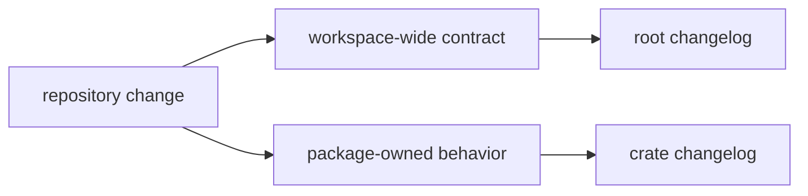

# Changelog

This file records workspace-level changes for `bijux-telecom`. Package-specific
API, command, runtime, fixture, signal, navigation, infrastructure, and policy
changes are recorded beside the package that owns the changed surface.

The repository is in `0.1.0` development. Entries under `Unreleased` describe
work that has not been cut as a published release.

## How To Read This File

Use this changelog when a change affects more than one crate, changes the
workspace contract, or changes how maintainers validate the repository. If the
change is local to one crate, start in that crate's `CHANGELOG.md` and link back
here only when the workspace reader needs the context.

## Unreleased

### Added

- Workspace and crate-local changelog entrypoints now exist for every package.
- Package documentation now carries reader routes, ownership boundaries,
  verification focus, and API-reference surfaces.

### Changed

- Documentation is being tightened around package ownership, release history,
  evidence artifacts, and validation lanes.

## Entry Rules

- Record cross-crate behavior, repository structure, or release-process changes
  here.
- Record package-owned changes in the package changelog first.
- Do not duplicate low-level implementation details across root and package
  changelogs.
- Prefer reader impact over commit narration: what changed, who is affected, and
  which package owns the follow-up.
