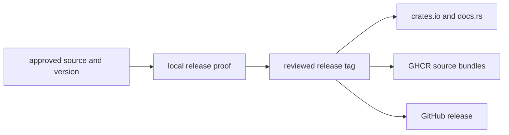

# Changelog

This file records changes that affect the `bijux-gnss` workspace as a whole.
Package changelogs record API, command, signal, navigation, receiver, and
infrastructure changes owned by one crate.

The repository is in `0.1.0` development. Entries under `Unreleased` describe
release preparation and behavior that have not been published.

## Unreleased

No crate, container artifact, or GitHub release described below has been
published. Publication will run through the managed release workflows after a
version and tag are approved.

### Added

- A machine-readable [crate publication contract](configs/release/crates.toml)
  identifies the six public crates, their dependency order, and the three
  repository-only support crates.
- Local release validation checks package metadata, license inclusion,
  dependency versions, publication eligibility, and packaged crate contents
  without uploading to a registry.
- The release builder produces per-crate source bundles and checksums for GHCR
  and GitHub Releases. GHCR receives source artifacts, not runnable images.
- Every public crate carries an Apache-2.0 license and direct routes to its
  crates.io package, API documentation, source bundle, and handbook.

### Changed

- The six public crates share workspace version `0.1.0` and complete crates.io
  metadata. Public dependencies declare both a workspace path and the release
  version.
- `bijux-gnss-dev`, `bijux-gnss-policies`, and `bijux-gnss-testkit` are
  explicitly repository-only. Public crates use them only as path-based
  development dependencies, so they are absent from published manifests.
- Release automation now separates proof from publication: local commands
  validate and package the release, while managed GitHub workflows own
  crates.io, GHCR, and GitHub publication.
- Workspace and package documentation now state which crate owns each public
  contract and which evidence supports a release decision.

## Release Route

The [release handbook](docs/bijux-gnss-dev/operations/release-and-versioning.md)
defines the publication boundary, commands, channels, version rules, and
failure policy. The [facade changelog](crates/bijux-gnss/CHANGELOG.md) records
changes to the `bijux` command and the top-level Rust API.

## Package Histories

| changed responsibility | release history |
| --- | --- |
| commands and public facade | [Facade and command history](crates/bijux-gnss/CHANGELOG.md) |
| shared identities, units, time, and artifacts | [Core contract history](crates/bijux-gnss-core/CHANGELOG.md) |
| signal definitions, codes, samples, and DSP | [Signal behavior history](crates/bijux-gnss-signal/CHANGELOG.md) |
| products, corrections, positioning, and integrity | [Navigation science history](crates/bijux-gnss-nav/CHANGELOG.md) |
| acquisition, tracking, observations, and runtime evidence | [Receiver runtime history](crates/bijux-gnss-receiver/CHANGELOG.md) |
| datasets, provenance, run layout, and inspection | [Infrastructure history](crates/bijux-gnss-infra/CHANGELOG.md) |

## Entry Rules

- Record a change here when it alters the publication boundary, shared version,
  cross-crate behavior, or repository-wide validation.
- Record package-owned behavior in that package's changelog instead of
  duplicating implementation detail here.
- Describe what changes for users or maintainers, the compatibility impact, and
  the evidence required before release.
