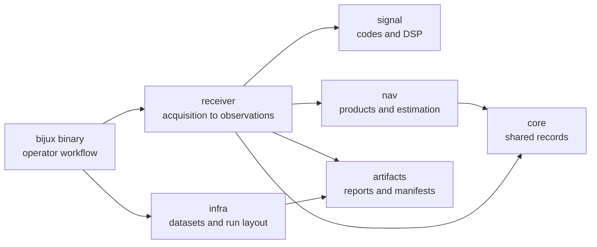

# bijux-telecom

`bijux-telecom` is a Rust GNSS workspace for signal modeling, receiver
execution, observations, navigation, and reproducible evidence. It prepares
six public Rust crates under one version and keeps repository policy, test
support, and maintainer automation out of public registries.

The `bijux-gnss` package owns the `bijux` command and the public facade. The
other five public packages expose focused libraries for shared contracts,
signals, navigation, receiver processing, and reproducible repository evidence.

<!-- bijux-telecom-badges:generated:start -->
[](https://github.com/bijux/bijux-telecom/blob/main/LICENSE)
[](https://github.com/bijux/bijux-telecom/actions/workflows/ci.yml?query=branch%3Amain)
[](https://github.com/bijux/bijux-telecom/actions/workflows/deploy-docs.yml)
[](https://github.com/bijux/bijux-telecom/releases)
[](https://github.com/bijux?tab=packages&repo_name=bijux-telecom)
[](https://github.com/bijux/bijux-telecom/tree/main/crates)

[](https://crates.io/crates/bijux-gnss)
[](https://crates.io/crates/bijux-gnss-core)
[](https://crates.io/crates/bijux-gnss-infra)
[](https://crates.io/crates/bijux-gnss-nav)
[](https://crates.io/crates/bijux-gnss-receiver)
[](https://crates.io/crates/bijux-gnss-signal)

[](https://github.com/bijux/bijux-telecom/pkgs/container/bijux-telecom%2Fbijux-gnss)
[](https://github.com/bijux/bijux-telecom/pkgs/container/bijux-telecom%2Fbijux-gnss-core)
[](https://github.com/bijux/bijux-telecom/pkgs/container/bijux-telecom%2Fbijux-gnss-infra)
[](https://github.com/bijux/bijux-telecom/pkgs/container/bijux-telecom%2Fbijux-gnss-nav)
[](https://github.com/bijux/bijux-telecom/pkgs/container/bijux-telecom%2Fbijux-gnss-receiver)
[](https://github.com/bijux/bijux-telecom/pkgs/container/bijux-telecom%2Fbijux-gnss-signal)

[](https://github.com/bijux/bijux-telecom/tree/main/docs)
[](https://docs.rs/bijux-gnss/latest/bijux_gnss/)
<!-- bijux-telecom-badges:generated:end -->

## Current Status

The workspace is preparing its first `0.1.0` release. The crates.io, docs.rs,
GHCR, and GitHub links describe the intended public release surface; they do not
mean that a release has already been published. Until the first release, run
commands and depend on crates from this checkout.

## Release Surface

All six public crates use the workspace version and publish in dependency
order. A release tag is one product release, not six independently versioned
package events.

| public crate | crates.io and docs.rs responsibility | GHCR bundle |
| --- | --- | --- |
| `bijux-gnss-core` | shared contracts and value types | package source archive and release metadata |
| `bijux-gnss-signal` | signal catalogs, codes, samples, and DSP | package source archive and release metadata |
| `bijux-gnss-nav` | products, corrections, positioning, RTK, PPP, and integrity | package source archive and release metadata |
| `bijux-gnss-receiver` | acquisition, tracking, observations, diagnostics, and receiver artifacts | package source archive and release metadata |
| `bijux-gnss-infra` | datasets, provenance, run layout, overrides, and experiment infrastructure | package source archive and release metadata |
| `bijux-gnss` | facade library and installable `bijux` command | package source archive and release metadata |

Repository-only crates never publish to crates.io or GHCR:
`bijux-gnss-dev`, `bijux-gnss-policies`, and `bijux-gnss-testkit`.
The machine-readable [crate release contract](configs/release/crates.toml)
defines the same allow/deny boundary and publication order used by release
tooling.

## What This Repository Gives You

- A deterministic receiver path from raw IQ through acquisition, tracking,
  observations, and optional PVT.
- Signal catalogs and DSP primitives for GPS, Galileo, BeiDou, and GLONASS
  surfaces currently covered by the crate tests.
- Navigation-product parsing, correction models, SPP/RTK/PPP scaffolding, and
  refusal evidence for unsafe solutions.
- Dataset registry, run layout, artifact contracts, provenance, and validation
  reports that make local evidence reviewable.
- Maintainer guardrails for dependency direction, audit policy, benchmarks, and
  fast-versus-slow test selection.



## Use the Checkout

```bash
cargo build --workspace
cargo run -q -p bijux-gnss -- gnss --help
```

Minimum supported Rust version: `1.86.0`.

The examples below use the future installed command form, `bijux gnss ...`.
From this checkout, replace `bijux` with
`cargo run -q -p bijux-gnss --`.

## First Useful Commands

Inspect the checked-in deterministic raw-IQ fixture:

```bash
bijux gnss inspect --dataset demo_synthetic --output artifacts/basic_ingest
```

Example output:
```
Artifacts: artifacts/basic_ingest/artifacts
Manifest: artifacts/basic_ingest/manifest.json
```

`demo_synthetic` proves explicit format, sample-rate, IF, and capture-time
handling. It is not a satellite-truth positioning dataset.

Export a deterministic synthetic capture with machine-readable truth:

```bash
bijux gnss export-synthetic-iq \
  --scenario configs/scenarios/synthetic_iq_reference.toml \
  --report json \
  --out artifacts/synthetic_iq_reference
```

Validate a single-satellite C/N0 calibration scenario against injected truth:

```bash
bijux gnss export-synthetic-iq \
  --scenario configs/scenarios/synthetic_iq_cn0_reference.toml \
  --report json \
  --out artifacts/synthetic_iq_cn0_reference

bijux gnss validate-synthetic-iq \
  --unregistered-dataset \
  --file artifacts/synthetic_iq_cn0_reference/artifacts/synthetic_iq_cn0_reference.iq16 \
  --sidecar artifacts/synthetic_iq_cn0_reference/artifacts/synthetic_iq_cn0_reference.sidecar.toml \
  --truth artifacts/synthetic_iq_cn0_reference/artifacts/synthetic_iq_cn0_reference.truth.json \
  --config configs/receiver_low_rate.toml \
  --report json \
  --out artifacts/synthetic_iq_cn0_validation
```

Measure quantization loss against a float reference:

```bash
bijux gnss measure-synthetic-quantization \
  --scenario configs/scenarios/synthetic_iq_reference.toml \
  --config configs/receiver_low_rate.toml \
  --report json \
  --out artifacts/synthetic_quantization_reference
```

Validate the bundled navigation accuracy case:

```bash
bijux gnss validate-synthetic-navigation \
  --scenario configs/scenarios/synthetic_navigation_accuracy.toml \
  --config configs/receiver_low_rate.toml \
  --report json \
  --out artifacts/synthetic_navigation_accuracy
```

Run public real-RF acquisition against the registered live-sky excerpt:

```bash
bijux gnss acquire \
  --dataset gps_l1_2022_03_27_excerpt \
  --config configs/receiver_live_sky_gps_l1.toml \
  --prn 11,12,25,31,32 \
  --report json \
  --output artifacts/live_sky_acquire
```

Review the live-sky capture's source and redistribution terms in the
[GPS L1 dataset provenance](datasets/recorded/gps_l1_2022_03_27_excerpt.provenance.md).

## Package Map

| package | owns | start here |
| --- | --- | --- |
| `bijux-gnss` | public facade and `bijux` command workflow | [Command crate README](crates/bijux-gnss/README.md), [Command handbook](docs/01-bijux-gnss/) |
| `bijux-gnss-core` | shared IDs, units, time, records, diagnostics, and artifact envelopes | [Core crate README](crates/bijux-gnss-core/README.md), [Core handbook](docs/02-bijux-gnss-core/) |
| `bijux-gnss-infra` | datasets, run layout, provenance, hashing, overrides, and experiment infrastructure | [Infra crate README](crates/bijux-gnss-infra/README.md), [Infra handbook](docs/03-bijux-gnss-infra/) |
| `bijux-gnss-nav` | navigation products, corrections, orbit propagation, estimators, RTK, PPP, and RAIM | [Navigation crate README](crates/bijux-gnss-nav/README.md), [Navigation handbook](docs/04-bijux-gnss-nav/) |
| `bijux-gnss-receiver` | receiver runtime, acquisition, tracking, observations, diagnostics, and receiver artifacts | [Receiver crate README](crates/bijux-gnss-receiver/README.md), [Receiver handbook](docs/05-bijux-gnss-receiver/) |
| `bijux-gnss-signal` | signal registry, code families, raw sample contracts, and reusable DSP | [Signal crate README](crates/bijux-gnss-signal/README.md), [Signal handbook](docs/06-bijux-gnss-signal/) |
| `bijux-gnss-dev` | maintainer commands, audit policy, benchmark evidence, and test-lane governance | [Maintainer crate README](crates/bijux-gnss-dev/README.md), [Maintainer handbook](docs/07-bijux-gnss-dev/) |
| `bijux-gnss-policies` | executable repository-shape guardrails and policy snapshots | [Policy crate README](crates/bijux-gnss-policies/README.md) |
| `bijux-gnss-testkit` | shared fixtures, independent truth models, and test evidence | [Testkit crate README](crates/bijux-gnss-testkit/README.md) |

## Evidence And Artifacts

Generated run evidence belongs under `artifacts/`. Commands that write
receiver or validation output also produce machine-readable reports such as
manifests, sidecars, quality reports, truth JSON, stage summaries, and accuracy
artifacts. Start with the command output path, then follow the manifest into the
owning crate docs:

- command behavior: [Command crate docs](crates/bijux-gnss/docs/)
- persisted run layout: [Infra crate docs](crates/bijux-gnss-infra/docs/)
- receiver artifacts and validation reports:
  [Receiver crate docs](crates/bijux-gnss-receiver/docs/)
- shared artifact envelopes: [Core crate docs](crates/bijux-gnss-core/docs/)

## Verification Lanes

Use the maintained Make targets from the repository root:

```bash
make test
make test-slow
make test-all
```

`make test` is the fast lane. Slow proof tests belong in `make test-slow` and
the full lanes. Repository test policy lives in
[Repository test policy](docs/07-bijux-gnss-dev/quality/repository-test-policy.md).

## Documentation

- [GNSS workspace handbook](docs/index.md) routes readers to the owning package.
- [Badge reference](docs/badges.md) owns the generated badge block copied into
  public entry pages.
- [Workspace release history](CHANGELOG.md) records unpublished workspace-level
  behavior and release preparation.
- The [package directory](crates/) contains each crate's README and release
  history.

## Maturity

The workspace is in active `0.1.0` development. Tests, schemas, references, and
reproducible artifacts support current claims, but no published compatibility
guarantee exists yet. Release status and compatibility decisions belong in the
[workspace release history](CHANGELOG.md).
