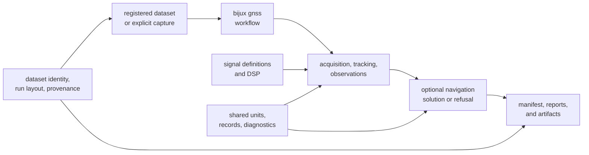

# bijux-telecom

`bijux-telecom` is a Rust workspace for turning GNSS samples and navigation
products into reviewable receiver and positioning evidence. It provides the
`bijux gnss` command, focused libraries for applications, and repository
support for reproducible datasets and runs.

<!-- bijux-telecom-badges:generated:start -->
[](https://github.com/bijux/bijux-telecom/blob/main/LICENSE)
[](https://github.com/bijux/bijux-telecom/actions/workflows/ci.yml?query=branch%3Amain)
[](https://github.com/bijux/bijux-telecom/actions/workflows/deploy-docs.yml)
[](https://github.com/bijux/bijux-telecom/releases)
[](https://github.com/bijux?tab=packages&repo_name=bijux-telecom)
[](https://github.com/bijux/bijux-telecom/tree/main/crates)

[](https://crates.io/crates/bijux-gnss)
[](https://crates.io/crates/bijux-gnss-core)
[](https://crates.io/crates/bijux-gnss-infra)
[](https://crates.io/crates/bijux-gnss-nav)
[](https://crates.io/crates/bijux-gnss-receiver)
[](https://crates.io/crates/bijux-gnss-signal)

[](https://github.com/bijux/bijux-telecom/pkgs/container/bijux-telecom%2Fbijux-gnss)
[](https://github.com/bijux/bijux-telecom/pkgs/container/bijux-telecom%2Fbijux-gnss-core)
[](https://github.com/bijux/bijux-telecom/pkgs/container/bijux-telecom%2Fbijux-gnss-infra)
[](https://github.com/bijux/bijux-telecom/pkgs/container/bijux-telecom%2Fbijux-gnss-nav)
[](https://github.com/bijux/bijux-telecom/pkgs/container/bijux-telecom%2Fbijux-gnss-receiver)
[](https://github.com/bijux/bijux-telecom/pkgs/container/bijux-telecom%2Fbijux-gnss-signal)

[](https://github.com/bijux/bijux-telecom/tree/main/docs)
[](https://docs.rs/bijux-gnss/latest/bijux_gnss/)
<!-- bijux-telecom-badges:generated:end -->

## Choose Your Starting Point

| You want to... | Start with... |
| --- | --- |
| inspect a capture, acquire satellites, or run a validation workflow | the [command package](crates/bijux-gnss/README.md) |
| embed acquisition, tracking, and observation production | the [receiver package](crates/bijux-gnss-receiver/README.md) |
| generate codes, convert raw samples, or use GNSS DSP primitives | the [signal package](crates/bijux-gnss-signal/README.md) |
| parse navigation products or compute positioning results | the [navigation package](crates/bijux-gnss-nav/README.md) |
| share typed identities, units, observations, diagnostics, or artifact records | the [core package](crates/bijux-gnss-core/README.md) |
| register datasets or persist reproducible run evidence | the [infrastructure package](crates/bijux-gnss-infra/README.md) |
| understand the complete repository | the [GNSS handbook](docs/index.md) |

The public facade is convenient when an application spans several domains.
Depending directly on a focused crate keeps features and ownership clearer when
only one domain is needed.

## Run A Reproducible Example

The workspace requires Rust `1.86.0` or newer. Before the first registry
release, run the command from this checkout:

```bash
cargo run -q -p bijux-gnss -- gnss inspect \
  --dataset demo_synthetic \
  --output artifacts/basic_ingest
```

The command resolves the checked-in synthetic capture, validates its declared
sample format and timing metadata, and writes a manifest beneath
`artifacts/basic_ingest`. This fixture demonstrates deterministic ingest. It is
not evidence of live-sky acquisition or positioning accuracy.

For a receiver claim with injected truth, export and validate the C/N0
calibration scenario:

```bash
cargo run -q -p bijux-gnss -- gnss export-synthetic-iq \
  --scenario configs/scenarios/synthetic_iq_cn0_reference.toml \
  --report json \
  --out artifacts/synthetic_iq_cn0_reference

cargo run -q -p bijux-gnss -- gnss validate-synthetic-iq \
  --unregistered-dataset \
  --file artifacts/synthetic_iq_cn0_reference/artifacts/synthetic_iq_cn0_reference.iq16 \
  --sidecar artifacts/synthetic_iq_cn0_reference/artifacts/synthetic_iq_cn0_reference.sidecar.toml \
  --truth artifacts/synthetic_iq_cn0_reference/artifacts/synthetic_iq_cn0_reference.truth.json \
  --config configs/receiver_low_rate.toml \
  --report json \
  --out artifacts/synthetic_iq_cn0_validation
```

Read the output manifest first. It connects the input identity, configuration,
reports, and generated artifacts so the result can be reviewed without
reconstructing the command from terminal history. The
[command workflow guide](docs/01-bijux-gnss/operations/common-workflows.md) covers the
other acquisition, synthetic-IQ, quantization, and navigation workflows.

## Follow A Sample Through The Workspace



This is an ownership map, not a claim that every command executes every stage.
Acquisition can stop before tracking; receiver runs can omit navigation; and
validation commands may compare existing evidence without replaying a full
pipeline. Degraded and refused outcomes are part of the result contract rather
than hidden as successful-looking output.

## Public Packages

Six packages are prepared for crates.io, docs.rs, GHCR, and GitHub releases
under one workspace version:

| Package | Public responsibility |
| --- | --- |
| `bijux-gnss-core` | canonical identities, units, time, observations, diagnostics, and artifact envelopes |
| `bijux-gnss-signal` | signal catalogs, codes, raw samples, replicas, and DSP |
| `bijux-gnss-nav` | navigation products, corrections, positioning, RTK, PPP, and integrity |
| `bijux-gnss-receiver` | acquisition, tracking, observations, runtime diagnostics, and receiver artifacts |
| `bijux-gnss-infra` | datasets, provenance, run layout, overrides, and experiment infrastructure |
| `bijux-gnss` | facade library and installable `bijux` command |

Three support packages remain repository-only:
`bijux-gnss-dev` runs maintainer workflows, `bijux-gnss-policies` enforces
repository boundaries, and `bijux-gnss-testkit` provides independent test
evidence. The [crate release contract](configs/release/crates.toml) is the
machine-readable authority for publication order and exclusions.

The workspace is preparing its first `0.1.0` release. Registry, package, and
release badges identify the intended destinations; they do not assert that a
release already exists. Publication is performed later through the governed
GitHub release workflows.

## Read And Verify Evidence

Generated evidence belongs under `artifacts/`. Use the owning documentation
when interpreting it:

- [Command reports](crates/bijux-gnss/docs/REPORTING.md) explain operator output.
- [Receiver artifacts](crates/bijux-gnss-receiver/docs/ARTIFACTS.md) describe
  in-memory stage evidence.
- [Run layout](crates/bijux-gnss-infra/docs/RUN_LAYOUT.md) defines persisted
  manifests, reports, and history.
- [Artifact contracts](crates/bijux-gnss-core/docs/SERIALIZATION.md) define
  shared versioned envelopes.
- [Dataset provenance](datasets/recorded/gps_l1_2022_03_27_excerpt.provenance.md)
  records the source and redistribution terms for the bundled live-sky excerpt.

Use the maintained lanes from the repository root:

```bash
make test
make test-slow
make test-all
```

`make test` excludes the governed slow roster. `make test-slow` runs that
roster, and `make test-all` runs both lanes. The
[repository test policy](docs/07-bijux-gnss-dev/quality/repository-test-policy.md)
defines the selection contract and the evidence each lane is intended to
provide.

Release preparation and compatibility decisions are recorded in the
[workspace release history](CHANGELOG.md). Package-specific history belongs
with each package rather than being inferred from this overview.
