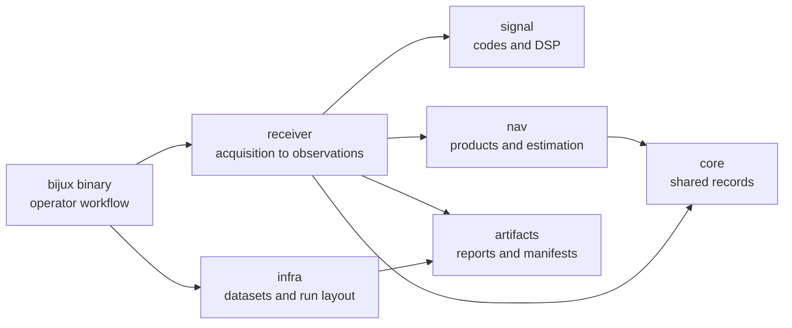

# bijux-telecom

`bijux-telecom` is a Rust GNSS workspace for signal modeling, receiver
execution, observations, navigation, and reproducible evidence. The public
package and binary are named `bijux-gnss`; the repository keeps the lower-level
science and infrastructure split into crates with explicit ownership.

<!-- bijux-telecom-badges:generated:start -->
[](https://github.com/bijux/bijux-telecom/blob/main/LICENSE)
[](https://github.com/bijux/bijux-telecom/actions/workflows/ci.yml)
[](https://github.com/bijux/bijux-telecom/actions/workflows/deploy-docs.yml)
[](https://github.com/bijux/bijux-telecom/actions/workflows/release-crates.yml)
[](https://github.com/bijux/bijux-telecom/actions/workflows/release-pypi.yml)
[](https://github.com/bijux/bijux-telecom/actions/workflows/release-ghcr.yml)
[](https://github.com/bijux/bijux-telecom/actions/workflows/release-github.yml)
[](https://github.com/bijux/bijux-telecom/releases)
[](https://github.com/bijux?tab=packages&repo_name=bijux-telecom)
[](https://github.com/bijux/bijux-telecom)

[](https://github.com/bijux/bijux-telecom/tree/main/docs)
<!-- bijux-telecom-badges:generated:end -->

## What This Repository Gives You

- A deterministic receiver path from raw IQ through acquisition, tracking,
  observations, and optional PVT.
- Signal catalogs and DSP primitives for GPS, Galileo, BeiDou, and GLONASS
  surfaces currently covered by the crate tests.
- Navigation-product parsing, correction models, SPP/RTK/PPP scaffolding, and
  refusal evidence for unsafe solutions.
- Dataset registry, run layout, artifact contracts, provenance, and validation
  reports that make local evidence reviewable.
- Maintainer guardrails for dependency direction, audit policy, benchmarks, and
  fast-versus-slow test selection.



## Build

```bash
cargo build --workspace
```

Minimum supported Rust version: `1.86.0`.

## First Useful Commands

Inspect the checked-in deterministic raw-IQ fixture:

```bash
bijux gnss inspect --dataset demo_synthetic --output artifacts/basic_ingest
```

Example output:
```
Artifacts: artifacts/basic_ingest/artifacts
Manifest: artifacts/basic_ingest/manifest.json
```

`demo_synthetic` proves explicit format, sample-rate, IF, and capture-time
handling. It is not a satellite-truth positioning dataset.

Export a deterministic synthetic capture with machine-readable truth:

```bash
bijux gnss export-synthetic-iq \
  --scenario configs/scenarios/synthetic_iq_reference.toml \
  --report json \
  --out artifacts/synthetic_iq_reference
```

Validate a single-satellite C/N0 calibration scenario against injected truth:

```bash
bijux gnss export-synthetic-iq \
  --scenario configs/scenarios/synthetic_iq_cn0_reference.toml \
  --report json \
  --out artifacts/synthetic_iq_cn0_reference

bijux gnss validate-synthetic-iq \
  --unregistered-dataset \
  --file artifacts/synthetic_iq_cn0_reference/artifacts/synthetic_iq_cn0_reference.iq16 \
  --sidecar artifacts/synthetic_iq_cn0_reference/artifacts/synthetic_iq_cn0_reference.sidecar.toml \
  --truth artifacts/synthetic_iq_cn0_reference/artifacts/synthetic_iq_cn0_reference.truth.json \
  --config configs/receiver_low_rate.toml \
  --report json \
  --out artifacts/synthetic_iq_cn0_validation
```

Measure quantization loss against a float reference:

```bash
bijux gnss measure-synthetic-quantization \
  --scenario configs/scenarios/synthetic_iq_reference.toml \
  --config configs/receiver_low_rate.toml \
  --report json \
  --out artifacts/synthetic_quantization_reference
```

Validate the bundled navigation accuracy case:

```bash
bijux gnss validate-synthetic-navigation \
  --scenario configs/scenarios/synthetic_navigation_accuracy.toml \
  --config configs/receiver_low_rate.toml \
  --report json \
  --out artifacts/synthetic_navigation_accuracy
```

Run public real-RF acquisition against the registered live-sky excerpt:

```bash
bijux gnss acquire \
  --dataset gps_l1_2022_03_27_excerpt \
  --config configs/receiver_live_sky_gps_l1.toml \
  --prn 11,12,25,31,32 \
  --report json \
  --output artifacts/live_sky_acquire
```

The live-sky dataset provenance and redistribution details live in
`datasets/recorded/gps_l1_2022_03_27_excerpt.provenance.md`.

## Package Map

| package | owns | start here |
| --- | --- | --- |
| `bijux-gnss` | public facade and `bijux` command workflow | [Command crate README](crates/bijux-gnss/README.md), [Command handbook](docs/01-bijux-gnss/) |
| `bijux-gnss-core` | shared IDs, units, time, records, diagnostics, and artifact envelopes | [Core crate README](crates/bijux-gnss-core/README.md), [Core handbook](docs/02-bijux-gnss-core/) |
| `bijux-gnss-infra` | datasets, run layout, provenance, hashing, overrides, and experiment infrastructure | [Infra crate README](crates/bijux-gnss-infra/README.md), [Infra handbook](docs/03-bijux-gnss-infra/) |
| `bijux-gnss-nav` | navigation products, corrections, orbit propagation, estimators, RTK, PPP, and RAIM | [Navigation crate README](crates/bijux-gnss-nav/README.md), [Navigation handbook](docs/04-bijux-gnss-nav/) |
| `bijux-gnss-receiver` | receiver runtime, acquisition, tracking, observations, diagnostics, and receiver artifacts | [Receiver crate README](crates/bijux-gnss-receiver/README.md), [Receiver handbook](docs/05-bijux-gnss-receiver/) |
| `bijux-gnss-signal` | signal registry, code families, raw sample contracts, and reusable DSP | [Signal crate README](crates/bijux-gnss-signal/README.md), [Signal handbook](docs/06-bijux-gnss-signal/) |
| `bijux-gnss-dev` | maintainer commands, audit policy, benchmark evidence, and test-lane governance | [Maintainer crate README](crates/bijux-gnss-dev/README.md), [Maintainer handbook](docs/07-bijux-gnss-dev/) |
| `bijux-gnss-policies` | executable repository-shape guardrails and policy snapshots | [Policy crate README](crates/bijux-gnss-policies/README.md) |
| `bijux-gnss-testkit` | shared fixtures, independent truth models, and test evidence | [Testkit crate README](crates/bijux-gnss-testkit/README.md) |

## Evidence And Artifacts

Generated run evidence belongs under `artifacts/`. Commands that write
receiver or validation output also produce machine-readable reports such as
manifests, sidecars, quality reports, truth JSON, stage summaries, and accuracy
artifacts. Start with the command output path, then follow the manifest into the
owning crate docs:

- command behavior: [Command crate docs](crates/bijux-gnss/docs/)
- persisted run layout: [Infra crate docs](crates/bijux-gnss-infra/docs/)
- receiver artifacts and validation reports:
  [Receiver crate docs](crates/bijux-gnss-receiver/docs/)
- shared artifact envelopes: [Core crate docs](crates/bijux-gnss-core/docs/)

## Verification Lanes

Use the maintained Make targets from the repository root:

```bash
make test
make test-slow
make test-all
```

`make test` is the fast lane. Slow proof tests belong in `make test-slow` and
the full lanes. Repository test policy lives in
[Repository test policy](docs/07-bijux-gnss-dev/quality/repository-test-policy.md).

## Documentation

- [Repository handbook](docs/index.md) routes readers to the owning package.
- [Badge catalog](docs/badges.md) owns the generated badge block copied into
  public entry pages.
- [Workspace changelog](CHANGELOG.md) summarizes unreleased workspace-level
  documentation and release-history changes.
- Package changelogs live beside each [package README](crates/).

## Maturity

The workspace is in active `0.1.0` development. Interfaces and artifacts are
being stabilized through checked-in docs, tests, schemas, and reproducible
artifacts rather than through a published compatibility guarantee.
