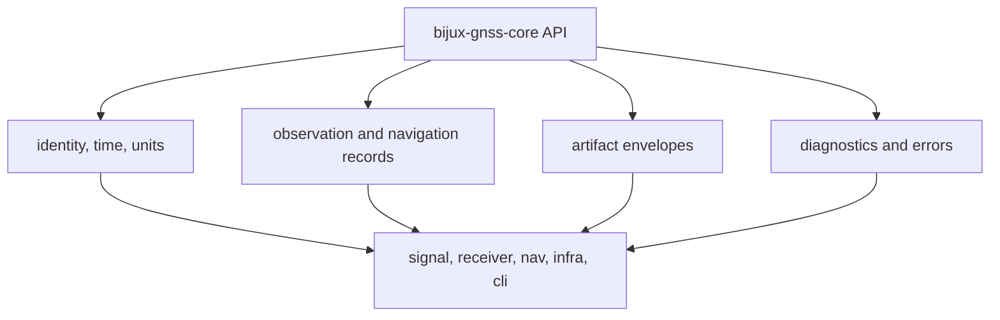

# bijux-gnss-core API

`bijux-gnss-core` is the stable vocabulary crate. Its public API gives the rest
of the workspace shared names for GNSS identity, time, units, records,
diagnostics, and artifact envelopes. This crate is where meaning is agreed
before receiver, signal, navigation, infrastructure, or CLI code exchange data.

## API Map

| family | representative items | contract owned here |
| --- | --- | --- |
| identity | `Constellation`, `SatId`, `SigId`, `SignalBand`, `SignalCode`, `SignalSpec` | Shared satellite and signal naming, including constellation-specific defaults and ordering. |
| time and units | `GpsTime`, `UtcTime`, `TaiTime`, `SampleTime`, `ReceiverSampleTrace`, `Seconds`, `Hertz`, `Meters` | Typed time and physical quantity conventions that downstream crates must not reinterpret. |
| geometry | `Ecef`, `Enu`, `Llh`, `geodetic_to_ecef`, `ecef_to_geodetic`, `elevation_azimuth_deg` | Common coordinate conversion contracts and WGS-84 helpers. |
| observations | `AcqResult`, `TrackEpoch`, `ObsEpoch`, `NavSolutionEpoch`, differencing records | Data exchanged from acquisition through navigation without stage-specific private structs leaking across crates. |
| artifacts | `ArtifactHeaderV1`, `ArtifactV1`, `ArtifactKind`, `ArtifactReadPolicy`, payload validation traits | Versioned envelope and validation rules for persisted scientific evidence. |
| diagnostics and errors | `DiagnosticEvent`, `DiagnosticSeverity`, `InputError`, `SignalError`, `TrackError`, `NavError` | Shared failure and diagnostic taxonomy. |
| support matrix | `SupportMatrix`, `SignalStageSupport`, `SupportStatus` | Stable statement of signal support across acquisition, tracking, observation, and navigation stages. |

## Boundary Rules

- Add a type here only when more than one crate needs the same meaning or when a
  persisted artifact requires a canonical schema.
- Keep runtime algorithms out of this crate. Core may validate and convert
  shared records, but it does not acquire, track, estimate, or persist runs.
- Preserve explicit units and time systems. A plain `f64` crossing crate
  boundaries needs a strong reason and a documented unit.
- Version serialized artifacts deliberately. A field added for convenience can
  become a long-term compatibility burden once persisted.

## Reader Guidance

Start from `src/api.rs` when you need the complete public surface. Use the
package docs for intent before editing:

- [docs/CONTRACTS.md](docs/CONTRACTS.md) for shared semantic contracts.
- [docs/CONTRACT_MAP.md](docs/CONTRACT_MAP.md) for artifact and record routing.
- [docs/DIAGNOSTICS.md](docs/DIAGNOSTICS.md) for diagnostic taxonomy.
- [docs/SERIALIZATION.md](docs/SERIALIZATION.md) for persisted schema rules.

## Review Checks

- New public records need clear owner, unit, and serialization expectations.
- Existing exported names must remain stable unless the breaking change is
  intentional and documented in the package changelog.
- Downstream convenience imports belong in the consuming crate unless the meaning
  is truly shared across the workspace.
