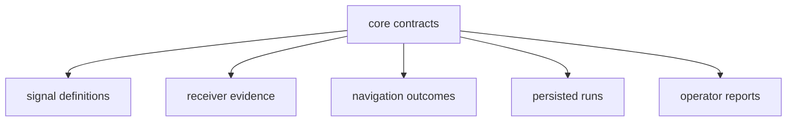

# bijux-gnss-core

[](https://crates.io/crates/bijux-gnss-core)
[](https://github.com/bijux/bijux-gnss/blob/main/LICENSE)
[](https://github.com/bijux/bijux-gnss)
[](https://crates.io/crates/bijux-gnss-core)
[](https://github.com/bijux/bijux-gnss/pkgs/container/bijux-gnss%2Fbijux-gnss-core)
[](https://docs.rs/bijux-gnss-core/latest/bijux_gnss_core/)
[](https://github.com/bijux/bijux-gnss/tree/main/docs/02-bijux-gnss-core)

`bijux-gnss-core` is the shared vocabulary of the bijux GNSS packages. It
defines identities, units, time, coordinates, observations, diagnostics,
navigation outcomes, support records, and versioned artifact envelopes.

Use core when a value crosses a package or persistence boundary and both sides
must agree on its meaning. Do not put an algorithm here merely because several
callers want it: acquisition belongs to the receiver, code generation belongs
to signal, estimation belongs to navigation, and file layout belongs to
infrastructure.

## Import The Contract, Not Its Storage

Downstream code uses the curated `api` module:

```rust
use bijux_gnss_core::api::{Constellation, Hertz, SatId};

let satellite = SatId {
    constellation: Constellation::Gps,
    prn: 11,
};
let sample_rate = Hertz(4_000_000.0);
```

Internal modules are private so records can be reorganized without forcing
callers to follow the source tree. If a type is not exported through `api`,
that absence is part of the boundary: first decide whether the concept is
truly shared before expanding the public surface.

The first registry release has not been published. Within this workspace, use
the package dependency already declared by the consuming crate. The prepared
registry name is `bijux-gnss-core`, and the Rust import name is
`bijux_gnss_core`.

## Find The Right Contract Family

| Data crossing a boundary | Canonical guide |
| --- | --- |
| satellite, signal, unit, coordinate, or time identity | [Shared contract catalog](docs/CONTRACTS.md) |
| acquisition, tracking, observation, or navigation record | [Contract ownership map](docs/CONTRACT_MAP.md) |
| stable diagnostic code, severity, event, or summary | [Diagnostic contract](docs/DIAGNOSTICS.md) |
| versioned artifact header or payload | [Serialization and reader policy](docs/SERIALIZATION.md) |
| signal-stage capability statement | [Support inventory semantics](docs/SUPPORT_MATRIX.md) |
| proposed public or semantic change | [Compatibility rules](docs/CHANGE_RULES.md) |

Core records describe what happened or what a consumer may rely on. They do not
perform receiver scheduling, choose navigation models, locate datasets, render
operator messages, or decide a repository path.

## Meaning Flows Outward



Core has no production dependency on another GNSS workspace package. That
direction matters: adding receiver, navigation, persistence, or command policy
to core would force every downstream consumer to inherit the wrong assumptions.

## Treat Semantic Changes As Compatibility Changes

A change can break readers even when Rust still compiles. Review all of these
before changing a shared type:

- units, coordinate frame, time scale, phase convention, and validity rules;
- enum variants, defaults, diagnostic meaning, and refusal categories;
- serialized field names, schema versions, and old-reader behavior;
- ordering and stability keys used by deterministic reports;
- every downstream producer and consumer of the record.

The current artifact reader supports schema version one. The exported
version-one-to-version-two conversion is only a placeholder because version two
has not been defined. Do not present it as migration support. The
[serialization guide](docs/SERIALIZATION.md) records this limitation and the
evidence needed before another version is introduced.

## Review A Core Change

Start with the [public API guide](docs/PUBLIC_API.md), then choose proof from
the [test evidence guide](docs/TESTS.md). Public-shape checks can detect some
unreviewed exports, but they do not prove semantic compatibility. Artifact
validation tests cover selected navigation and tracking invariants, not every
historical payload or every core record.

Reader-visible changes belong in the
[package release history](CHANGELOG.md). Broader ownership and dependency
decisions are explained in the [architecture guide](docs/ARCHITECTURE.md).
