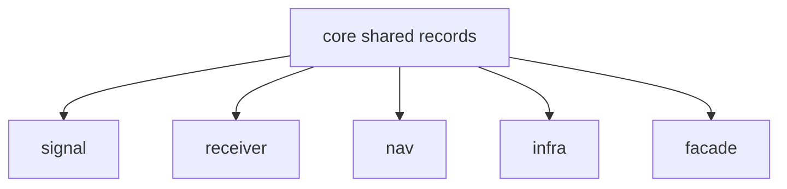

# bijux-gnss-core

`bijux-gnss-core` owns the shared GNSS vocabulary that other crates exchange:
identities, units, time, coordinates, diagnostics, observation records,
navigation-solution records, support matrices, and artifact envelopes.

Start here when two crates must agree on what a value means. Do not start here
for a runtime algorithm, a parser workflow, a command report, or a persisted run
layout unless that surface needs a shared record type.

## Reader Route

| question | go next |
| --- | --- |
| Which ID, unit, time, coordinate, or observation type is canonical? | [Contract guide](docs/CONTRACTS.md), `src/api.rs` |
| Which artifact envelope or schema rule applies? | [Contract map](docs/CONTRACT_MAP.md), [Serialization guide](docs/SERIALIZATION.md) |
| Which diagnostic or error category should a downstream crate use? | [Diagnostic guide](docs/DIAGNOSTICS.md), `src/diagnostic/`, `src/error.rs` |
| Which invariant must not be weakened? | [Invariant guide](docs/INVARIANTS.md), [Change rules](docs/CHANGE_RULES.md) |
| What changed in this package? | [Package changelog](CHANGELOG.md) |

## Owned Boundary

- canonical identifiers for constellations, satellites, and signals
- physical units, coordinate systems, and time-system conversion contracts
- acquisition, tracking, observation, differencing, and navigation records
- diagnostic taxonomies and shared error categories
- versioned artifact envelopes and payload validation rules

This crate does not own raw sample ingestion, filesystem layout, DSP execution,
navigation estimation strategy, receiver orchestration, or operator command
workflows.



## Source Map

- `src/artifact/` owns versioned artifact envelopes and payload validation.
- `src/config.rs`, `src/diagnostic/`, and `src/error.rs` own validation and
  failure-report semantics.
- `src/ids.rs`, `src/time.rs`, `src/units.rs`, and `src/geo.rs` own foundational
  scientific types.
- `src/observation/`, `src/observation_quality.rs`, and `src/nav_solution.rs`
  own exchanged receiver and navigation records.
- `src/conventions.rs`, `src/stats.rs`, and `src/support_matrix.rs` own shared
  semantic helpers that are still crate-foundational rather than
  runtime-specific.

## Documentation Map

- [Architecture guide](docs/ARCHITECTURE.md)
- [Boundary guide](docs/BOUNDARY.md)
- [Change rules](docs/CHANGE_RULES.md)
- [Contract guide](docs/CONTRACTS.md)
- [Contract map](docs/CONTRACT_MAP.md)
- [Diagnostic guide](docs/DIAGNOSTICS.md)
- [Invariant guide](docs/INVARIANTS.md)
- [Public API](docs/PUBLIC_API.md)
- [Serialization guide](docs/SERIALIZATION.md)
- [Support matrix](docs/SUPPORT_MATRIX.md)
- [Test guide](docs/TESTS.md)

## Verification Focus

Run narrow tests when changing shared meaning:

```sh
cargo test -p bijux-gnss-core --test public_api_guardrail
cargo test -p bijux-gnss-core --test nav_artifact_validation
cargo test -p bijux-gnss-core --test tracking_artifact_validation
cargo test -p bijux-gnss-core --test prop_timekeeping
```

Repository-wide lanes and package routing are documented in the
[workspace README](../../README.md).
