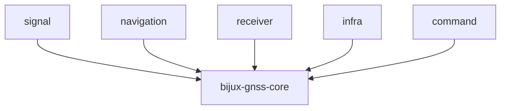

# bijux-gnss-core

[](https://crates.io/crates/bijux-gnss-core)
[](https://github.com/bijux/bijux-telecom/blob/main/LICENSE)
[](https://github.com/bijux/bijux-telecom)
[](https://crates.io/crates/bijux-gnss-core)
[](https://github.com/bijux/bijux-telecom/pkgs/container/bijux-telecom%2Fbijux-gnss-core)
[](https://docs.rs/bijux-gnss-core/latest/bijux_gnss_core/)
[](https://github.com/bijux/bijux-telecom/tree/main/docs/02-bijux-gnss-core)

`bijux-gnss-core` defines the GNSS contracts shared across `bijux-telecom`:
identities, units, time, coordinates, diagnostics, observations, navigation
results, support records, and versioned artifact envelopes.

Use this crate when two packages must agree on what data means. Use the signal,
navigation, receiver, infrastructure, or command package when the concern is an
algorithm, runtime policy, repository effect, or operator workflow.

## Availability

The first registry release has not been published. In this workspace, build or
test the package directly:

```sh
cargo test -p bijux-gnss-core
```

After publication, add it with `cargo add bijux-gnss-core`. The Cargo package
name is `bijux-gnss-core`; its Rust import name is `bijux_gnss_core`. All public
packages in this repository share one release version.

## Start with the Contract

| need | first guide |
| --- | --- |
| choose a canonical ID, unit, time, coordinate, observation, or solution type | [Contract guide](docs/CONTRACTS.md) |
| understand which family owns a shared type | [Contract map](docs/CONTRACT_MAP.md) |
| import a supported downstream contract | [Public API guide](docs/PUBLIC_API.md) |
| persist or validate a versioned record | [Serialization guide](docs/SERIALIZATION.md) |
| select a diagnostic code or shared error category | [Diagnostic guide](docs/DIAGNOSTICS.md) |
| assess compatibility before changing meaning | [Invariant guide](docs/INVARIANTS.md) and [change rules](docs/CHANGE_RULES.md) |
| see package-level changes | [Package changelog](CHANGELOG.md) |

## Import Contracts Through The API

```rust
use bijux_gnss_core::api::{
    Constellation, GpsTime, Hertz, ObsEpoch, SatId, ValidationReport,
};
```

`bijux_gnss_core::api` is the only supported downstream module. Implementation
families are private so internal organization can change without breaking
callers.

If a needed type is not exported, first ask whether it is genuinely shared. A
receiver loop state, navigation solver workspace, persistence helper, or command
rendering type should remain with its stronger owner.

## Contract Families

| family | examples | does not own |
| --- | --- | --- |
| identity and physical foundations | constellation, satellite, signal, units, coordinates, GPS/UTC/TAI and sample time | signal catalogs, runtime clocks, estimator policy |
| acquisition and tracking records | requests, results, transitions, assumptions, uncertainty, transmit time | acquisition search or tracking-loop execution |
| observations and quality | epochs, decisions, differencing, lock, covariance, cycle-slip evidence | measurement production or navigation estimation |
| navigation results | solution epochs, residuals, lifecycle, validity, refusal, inter-system bias | solvers, corrections, PPP, RTK |
| diagnostics and configuration | stable codes, severities, summaries, canonical errors, validation reports | operator wording or local defaults |
| conventions and summaries | sanity checks, Doppler and phase conventions, coordinate-derived statistical summaries | receiver thresholds or estimator policy |
| artifacts and support | headers, kinds, versioned payloads, validation traits, support inventory | filenames, run directories, manifests, history |

## Dependency And Ownership



Higher-level packages depend on core. Core's production code does not depend on
another GNSS workspace package, which keeps shared records free of runtime,
solver, persistence, and command assumptions.

## Compatibility Standard

Changes to core propagate widely. Before renaming, removing, or reshaping a
public contract:

1. Identify every downstream reader and writer.
2. State unit, time-scale, coordinate-frame, validity, and serialization
   implications.
3. Define how existing persisted artifacts are accepted, rejected, or
   converted.
4. Keep validation with the contract where practical.
5. Record the behavior change in the [package changelog](CHANGELOG.md).

Do not change old serialized meaning in place. Use an explicit version boundary
when readers need to distinguish old and new payloads.

The [core release guide](../../docs/02-bijux-gnss-core/operations/release-and-versioning.md)
maps each compatibility claim to the evidence required before publication.

## Documentation

| guide | purpose |
| --- | --- |
| [Architecture](docs/ARCHITECTURE.md) | contract flow, dependency direction, public admission, and persistence boundary |
| [Boundary](docs/BOUNDARY.md) | owned and refused responsibilities |
| [Contracts](docs/CONTRACTS.md) | shared record families |
| [Serialization](docs/SERIALIZATION.md) | durable payload and fixture rules |
| [Diagnostics](docs/DIAGNOSTICS.md) | codes, severity, events, and summaries |
| [Support matrix](docs/SUPPORT_MATRIX.md) | supported-signal inventory semantics |
| [Tests](docs/TESTS.md) | protecting proof and command selection |

The repository-level [Core handbook](../../docs/02-bijux-gnss-core/) adds
reader routes for architecture, interfaces, operations, and quality.

## Focused Verification

Choose the check that protects the changed contract:

```sh
cargo test -p bijux-gnss-core --test public_api_guardrail
cargo test -p bijux-gnss-core --test nav_artifact_validation
cargo test -p bijux-gnss-core --test tracking_artifact_validation
cargo test -p bijux-gnss-core --test prop_timekeeping
```

Use the [test guide](docs/TESTS.md) before making a broader proof claim.
