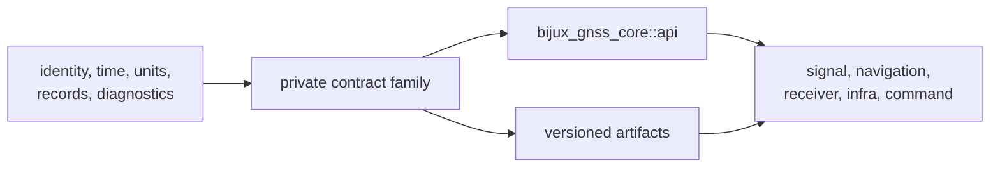
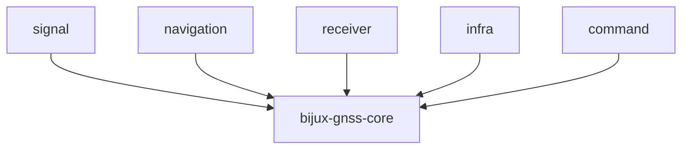

# Architecture

`bijux-gnss-core` defines GNSS meaning that several packages must exchange
without reinterpretation. It has no receiver pipeline, navigation solver,
repository layout, or command workflow. Its architecture is a set of durable,
mostly pure contract families exposed through one curated API.

## Contract Flow

## Contract Families

| family | responsibility | code route |
| --- | --- | --- |
| identity | constellation, satellite, signal, component, and registry identity | [Identity contracts](../src/ids.rs) |
| time and units | GPS, UTC, TAI, sample clocks, leap seconds, and strong physical quantities | [Time contracts](../src/time.rs) and [unit contracts](../src/units.rs) |
| geometry and conventions | WGS-84 transforms plus shared sanity and conversion law | [Geometry helpers](../src/geo.rs) and [scientific conventions](../src/conventions.rs) |
| observations | acquisition, tracking, observation, differencing, timing, and decision records | [Observation contracts](../src/observation/) |
| measurement quality | lock, covariance, cycle-slip, and measurement error evidence | [Observation quality](../src/observation_quality.rs) |
| navigation results | solution epochs, residuals, lifecycle, refusal, and inter-system bias records | [Navigation solution contracts](../src/nav_solution.rs) |
| artifacts | headers, kind policy, versioned payloads, conversion, and payload validation | [Artifact namespace](../src/artifact.rs) and [versioned payloads](../src/artifact/) |
| diagnostics and errors | stable codes, severities, events, aggregation, and canonical error categories | [Diagnostic contracts](../src/diagnostic/) and [error taxonomy](../src/error.rs) |
| configuration and support | schema-aware validation, support inventory, and shared statistical summaries | [Configuration contracts](../src/config.rs), [support matrix](../src/support_matrix.rs), and [statistics](../src/stats.rs) |

## Dependency Direction

Core's production dependency graph contains only general-purpose libraries for
serialization, errors, and numeric representation. It does not depend on
another GNSS workspace package.

The arrows show allowed dependency direction: higher packages consume core.
Reversing an arrow would import runtime, solver, persistence, or operator
assumptions into the shared language.

## Public Surface

Implementation families remain private. The
[curated API](../src/api.rs) re-exports contracts that are deliberately shared;
the [crate boundary](../src/lib.rs) exposes only that API module.

A type belongs in the public API when:

1. More than one package needs the same semantics.
2. Units, time systems, coordinate frames, validity, and serialization are
   explicit.
3. The type remains useful without one caller's runtime or storage policy.
4. Its validation travels with the contract where practical.

If a caller needs an internal type directly, review ownership before widening
the API. Convenience alone is not a cross-package contract.

## Persistence Boundary

Core owns artifact envelope and payload meaning. Infra owns filenames,
directories, run manifests, history, and repository discovery. A serialized
core record should remain interpretable without the process that produced it,
but core does not decide where that record is stored.

Schema changes must define reader behavior. Current validation tests protect
navigation and tracking payload rules, while older or unsupported schema policy
must remain explicit rather than being silently reinterpreted.

## Verification Routes

- [Public API guardrail](../tests/public_api_guardrail.rs) protects deliberate
  re-exports.
- [Navigation artifact validation](../tests/nav_artifact_validation.rs) and
  [tracking artifact validation](../tests/tracking_artifact_validation.rs)
  protect selected serialized payload rules.
- [Timekeeping properties](../tests/prop_timekeeping.rs) protect time
  conversion invariants.
- [Package guardrail](../tests/integration_guardrails.rs) protects the crate
  boundary.

Continue with the [contract map](CONTRACT_MAP.md) for placement rules, the
[serialization guide](SERIALIZATION.md) for persisted meaning, and the
[invariant guide](INVARIANTS.md) before changing a shared contract.
