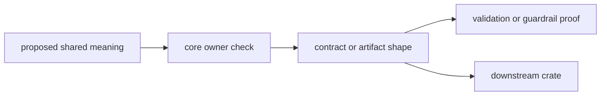

# Change Rules

`bijux-gnss-core` is the most amplified crate in the GNSS workspace. Small edits
here travel through every higher-level crate, so a core change needs a clear
contract reason before it needs a code location.

## Change Flow

## When a change belongs here

A change belongs in `bijux-gnss-core` when it defines shared GNSS meaning that
multiple crates must exchange without reinterpretation:

- contract types
- typed identifiers
- time and unit semantics
- shared diagnostics
- versioned artifact payload rules

If a concept is local to one runtime, one parser, one repository workflow, or one command path, it
does not belong here.

## Required Discipline

1. Prefer additive evolution over silent semantic rewrites.
2. When serialized meaning changes, update the [serialization guide](SERIALIZATION.md),
   [contract guide](CONTRACTS.md), and relevant validation tests in the same change set.
3. When public exports change, update the [public API](PUBLIC_API.md) and keep `api.rs` curated.
4. When invariants change, document the new downstream assumption in the [invariant guide](INVARIANTS.md)
   and keep the protecting tests aligned.

## Owner Decision Table

| concern | core owns it when | better owner |
| --- | --- | --- |
| identifier, unit, time, coordinate | more than one crate exchanges it as shared meaning | local crate-specific type |
| artifact payload contract | serialized shape must be interpreted consistently | infra layout or command report |
| diagnostic taxonomy | multiple crates need the same failure vocabulary | receiver/nav local refusal details |
| helper function | it preserves shared contract meaning | runtime, parser, or command helper |

## Smells That Usually Mean Wrong Crate

- needs filesystem paths or manifests
- needs source scheduling or runtime state machines
- needs domain-specific navigation estimation internals
- exists only to help one CLI workflow

Those belong in `infra`, `receiver`, `nav`, or `gnss`, not here.

## Review Checks

- Which downstream crates need the same meaning?
- What serialized or public contract changes?
- Which test fails if the shared meaning is weakened?
