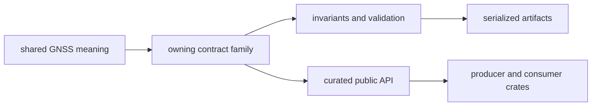

# Contract Map

Use this map to locate a shared GNSS meaning and decide whether a new type
belongs in `bijux-gnss-core`. The crate owns vocabulary exchanged across
packages; it does not own the algorithms, runtime policy, persistence layout,
or operator workflow that consume that vocabulary.

## Contract Flow

## Find the Owner

| contract family | use it for | implementation |
| --- | --- | --- |
| artifacts | versioned envelopes, headers, kinds, read policy, and payload validation | [artifact contracts](../src/artifact.rs) |
| configuration | schema versions, composable configuration, and validation reports | [configuration contracts](../src/config.rs) |
| conventions | shared phase, Doppler, observation, and solution sanity conventions | [scientific conventions](../src/conventions.rs) |
| diagnostics and errors | stable codes, severity, events, summaries, and canonical error categories | [diagnostic contracts](../src/diagnostic/mod.rs) and [error taxonomy](../src/error.rs) |
| identities | constellations, satellites, signals, components, and GLONASS channels | [identity contracts](../src/ids.rs) |
| time | GPS, UTC, TAI, receiver samples, clocks, epochs, and leap seconds | [time contracts](../src/time.rs) |
| units | strong wrappers and conversions for time, distance, frequency, phase, and code | [unit contracts](../src/units.rs) |
| coordinates | WGS-84 geodetic and Cartesian values and transforms | [coordinate contracts](../src/geo.rs) |
| receiver observations | acquisition, tracking, observation, differencing, covariance, and quality records | [observation contracts](../src/observation.rs) and [quality contracts](../src/observation_quality.rs) |
| navigation outcomes | solution epochs, residuals, lifecycle, validity, refusal, and inter-system bias | [navigation result contracts](../src/nav_solution.rs) |
| support inventory | stage-level capability rows and support status | [support contracts](../src/support_matrix.rs) |
| statistical summaries | coordinate conversion and reusable summary statistics | [statistical contracts](../src/stats.rs) |

All supported downstream imports pass through the
[curated public API](../src/api.rs). A source location in this table identifies
ownership; it is not permission for another crate to import private modules.

## Decide Whether a Type Belongs Here

Keep a type in its stronger owner unless all of these are true:

1. At least two packages exchange the same meaning.
2. Producers and consumers agree on units, identity, time system, frame,
   validity, and failure semantics.
3. The type remains useful without receiver scheduling, signal algorithms,
   navigation estimation, repository layout, or command presentation.
4. Serialization and validation rules can be stated at the shared-contract
   boundary.

If only one package needs the type, keep it there. If multiple packages merely
need similar local state, do not create a shared record until their meanings are
actually identical.

## Admit a Public Contract

Before adding an export:

- document the contract family in the [contract guide](CONTRACTS.md)
- state invariants and invalid states in the [invariant guide](INVARIANTS.md)
- define persisted behavior in the [serialization guide](SERIALIZATION.md)
  when the type crosses an artifact boundary
- add direct public-surface and semantic evidence described in the
  [test guide](TESTS.md)
- record compatibility impact in the [package release history](../CHANGELOG.md)

The [change rules](CHANGE_RULES.md) explain how to review downstream ownership
and compatibility when an existing contract changes.
