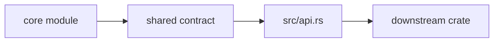

# Contract Map

This file maps the main `bijux-gnss-core` modules to the contract families they
own. Core is intentionally dense because it is foundational; the map exists so a
reader can place shared types before adding another cross-crate record.

## Contract Flow

## Module-To-Contract Ownership

| module | owned contract |
| --- | --- |
| `src/artifact/` | Versioned artifact envelopes, headers, kind tagging, and payload validation traits. |
| `src/config.rs` | Schema versioning and configuration validation-report contracts. |
| `src/diagnostic/` and `src/error.rs` | Shared failure taxonomies, severity, event, and summary records. |
| `src/ids.rs` | Constellation, satellite, signal, and related identity contracts. |
| `src/time.rs` | GPS, UTC, TAI, sample-time, and leap-second contracts. |
| `src/units.rs` | Strong physical unit wrappers and conversion semantics. |
| `src/geo.rs` | Geodetic and Cartesian coordinate contracts. |
| `src/observation/` and `src/observation_quality.rs` | Acquisition, tracking, observation, differencing, covariance, and quality records. |
| `src/nav_solution.rs` | Navigation-solution, residual, refusal, and inter-system-bias records. |
| `src/support_matrix.rs` | Supported-signal inventory contracts. |

## Placement Rules

- Put a type in core only when more than one crate needs the same durable
  meaning.
- Put runtime behavior in receiver, signal math in signal, navigation science in
  nav, and persistence policy in infra.
- Re-export deliberate public contracts through `src/api.rs`; avoid downstream
  dependencies on implementation module paths.

## Review Checks

- Does the new type carry shared meaning, or is it only local convenience?
- Are units, time systems, coordinate frames, and serialization behavior clear?
- Is the owning module obvious from this map?
