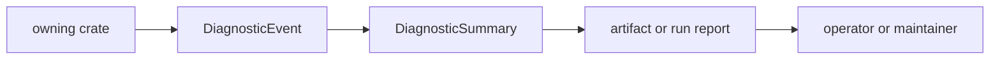

# Diagnostics

`bijux-gnss-core` owns the shared diagnostic language used across the GNSS
stack. Diagnostics are machine-readable evidence that a stage can emit and a
different layer can aggregate, persist, or render without losing meaning.

## Diagnostic Flow

## Owned Surface

| item | responsibility |
| --- | --- |
| `DiagnosticSeverity` | Shared severity vocabulary for informational, warning, and failure evidence. |
| `DiagnosticEvent` | A single typed diagnostic with code, message, and context. |
| `DiagnosticCode` and `DIAGNOSTIC_CODES` | Stable diagnostic-code metadata used by producers and readers. |
| `DiagnosticSummary` and `DiagnosticSummaryEntry` | Aggregated diagnostic evidence for reports and artifacts. |
| `aggregate_diagnostics` | Shared aggregation behavior that avoids every crate inventing its own summary shape. |

## Contract Rules

- A diagnostic code must describe a durable condition, not a local log sentence.
- Severity must reflect reader actionability and data quality impact.
- Diagnostic events must preserve enough context for the emitting crate to be
  identified without making the reader inspect private implementation state.
- Core owns diagnostic shape and shared meaning; runtime log routing and
  operator prose belong to higher layers.

## Reader Guidance

- Receiver code should use diagnostics for acquisition, tracking, observation,
  runtime, and support evidence that needs to survive beyond local logs.
- Navigation code should use diagnostics for refused or degraded solution
  claims where a downstream report needs stable reason categories.
- Infrastructure and CLI code may aggregate and render diagnostics, but should
  not invent incompatible severity or code tables.

## Review Checks

- New diagnostic codes need stable names, severity intent, and at least one
  producer or consumer.
- Do not add a code for a one-off debug message.
- If a diagnostic affects persisted artifacts or reports, update the owning
  artifact or reporting docs in the same change.
