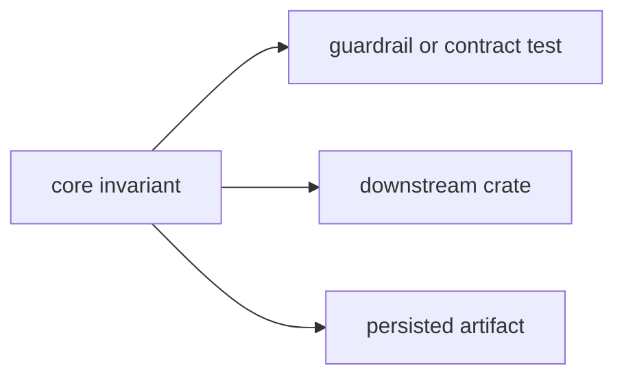

# Invariants

This file records behavior downstream crates can rely on when they consume
`bijux-gnss-core`. These invariants protect the shared vocabulary from becoming
runtime logic, convenience glue, or unversioned artifact shape.

## Invariant Flow

## Public-Surface Invariants

- Public structs and free functions must be deliberately re-exported through
  `src/api.rs`.
- Higher-level crates should not depend on implementation module paths directly.

Enforced by `tests/public_api_guardrail.rs`.

## Artifact Invariants

- Navigation artifact payload validation rejects inconsistent model versions and
  satellite counts.
- Navigation artifact payload validation catches non-finite DOPs, non-finite
  covariances, and inconsistent clock-bias units.
- Tracking and navigation artifact validators remain responsible for payload
  coherence, not just type shape.

Enforced by `tests/nav_artifact_validation.rs` and
`tests/tracking_artifact_validation.rs`.

## Time Invariants

- GPS, UTC, and receiver-sample time conversions stay property-tested and
  regression-locked.
- Timekeeping helpers must preserve deterministic behavior under the existing
  proptest corpus.

Enforced by `tests/prop_timekeeping.rs` and
`tests/prop_timekeeping.proptest-regressions`.

## Boundary Invariants

- `bijux-gnss-core` remains free of higher-level workspace crate dependencies.
- The crate stays a contract foundation rather than becoming a runtime or
  orchestration surface.

Guardrail coverage is exercised in `tests/integration_guardrails.rs`.

## Review Checks

- A new invariant needs an enforcing test or an explicit reason enforcement is
  not practical yet.
- A changed invariant needs downstream compatibility reviewed before commit.
- Avoid weakening a core invariant to make one higher-level crate easier to
  implement.
