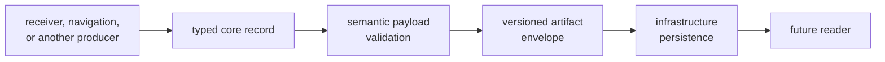
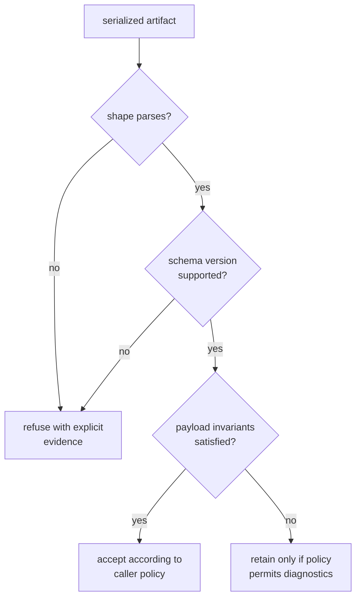

# Serialization Contracts

Serialization makes core records readable outside the process and release that
created them. The contract includes field meaning, units, validity, schema
version, and reader behavior; producing valid JSON or another valid byte shape
is only the transport layer.

## Ownership Boundary

Core owns the record and envelope meaning. Infrastructure owns filenames,
directories, manifests, history, and storage. Command code owns operator
selection and presentation. Neither storage nor presentation may silently
reinterpret an invalid or unsupported core payload.

## Serialized Families

| Family | Durable meaning |
| --- | --- |
| Artifact envelopes | producer, schema version, kind, provenance, configuration identity, and payload |
| Acquisition, tracking, and observations | receiver evidence, uncertainty, decisions, timing, and measurement context |
| Navigation outcomes | solution, residual, lifecycle, refusal, integrity, and quality evidence |
| Diagnostics | severity, stable code, instance message, context, and summary |
| Foundation values | signal identity, time system, coordinate frame, and physical unit where embedded in persisted records |

The [contract catalog](CONTRACTS.md) identifies the owning families. A value
that requires one runtime’s scheduler, repository layout, or command context to
be understood does not yet have a portable core contract.

## Version and Reader Policy

The current [artifact contract](../src/artifact.rs) supports schema version one
only: the oldest and latest accepted versions are both one. The exposed
version-one-to-version-two conversion function is a placeholder with no
migration behavior because version two is not defined.

Before introducing another version, define:

- which old records remain readable
- whether conversion preserves all meaning or records a loss
- how unsupported versions are refused
- which defaults are safe for fields absent from old records
- how readers distinguish structural parse success from semantic validity
- which fixtures independently prove old-reader and new-reader behavior

Do not retroactively assign new meaning to an existing version.

## Validation Rules

- Persist units, frames, time systems, identity, validity, and provenance
  needed to interpret the payload.
- Validate cross-field coherence after parsing; field types alone cannot prove
  counts, statuses, uncertainty, refusal, and metadata agree.
- Reject non-finite values where the contract requires finite scientific
  evidence.
- Return structured diagnostics that identify the failed invariant. Do not
  require readers to parse prose.
- Keep payload validation with the family that defines the record, not in one
  command or storage adapter.
- Treat field removal, renaming, default changes, enum variants, and diagnostic
  meaning as compatibility decisions.

## Current Evidence

The [navigation validation suite](../tests/nav_artifact_validation.rs) exercises
selected version, count, clock, residual, covariance, and finite-value rules.
The [tracking validation suite](../tests/tracking_artifact_validation.rs)
exercises selected uncertainty and navigation-bit-sign rules. These tests are
representative contract checks, not exhaustive historical compatibility.

The [observation JSONL record](../tests/data/obs_fixture.jsonl) is checked in
but no current source or test reads it. It is dormant example data, not active
round-trip or backward-compatibility evidence. The
[fixture evidence guide](../../../docs/bijux-gnss-core/operations/fixture-and-regression-care.md)
defines what an active reader must prove before that status changes.

## Evidence Gaps

- There is no implemented cross-version migration.
- The checked-in observation record has no active reader.
- Existing artifact tests cover selected navigation and tracking invariants,
  not every acquisition, observation, support-matrix, trace, and payload rule.
- Parsing and semantic validation are not equivalent, and a green parse alone
  must not be reported as artifact validity.

A serialization change is ready when reader policy, schema meaning,
validation, old-data behavior, independent fixtures, and known coverage gaps
are all explicit.
