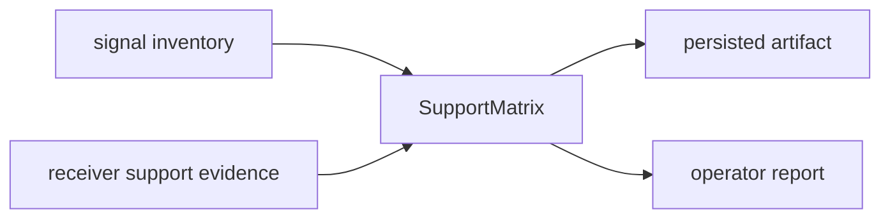

# Support Matrix

`bijux-gnss-core` owns the typed support-matrix contract that other crates can
exchange and persist. The support matrix answers a reader-facing question:
which signals are supported at which processing stages, and what evidence or
limitation explains that status?

## Support Flow

## Owned Surface

| item | responsibility |
| --- | --- |
| `SupportStatus` | Shared status vocabulary for supported, unavailable, limited, or future work. |
| `SignalStageSupport` | Stage-level support claim for acquisition, tracking, observation, or navigation. |
| `SignalSupportRow` | One signal's support evidence across stages. |
| `SupportMatrix` | Versioned cross-signal support table exchanged across crates and artifacts. |

## Contract Rules

- The matrix shape belongs to core because support status is shared meaning.
- The receiver may populate runtime evidence, infra may persist it, and the CLI
  may render it; none of those layers should redefine the type shape.
- A status must not imply more than the evidence supports. Limited, refused, or
  unsupported behavior should remain visible to readers.
- Signal identity must use core signal and constellation types, not string-only
  duplicates.

## Reader Guidance

Use the support matrix when you need a stable contract across package
boundaries. Use receiver docs when you need to know why a stage populated a
particular status. Use CLI docs when you need to know how the matrix is shown to
operators.

## Review Checks

- New support statuses need downstream rendering and artifact compatibility
  considered together.
- New stage fields need a clear owner that produces the evidence.
- Tests should verify both supported and refused or limited rows so the matrix
  does not become a marketing list.
