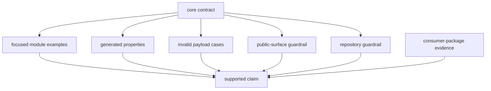
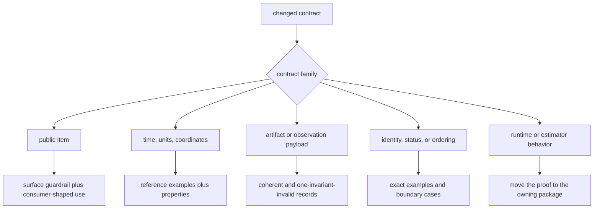

# Core Test Evidence

`bijux-gnss-core` tests protect shared record meaning, numerical conventions,
public access, and selected artifact invariants. They do not prove receiver
accuracy, navigation convergence, persistence behavior, or every serialized
payload family.

## Evidence Layers



A green package suite supports only the contracts exercised by these layers.
Workflow and scientific claims require evidence from the package that executes
them.

## Current Integration Evidence

| evidence | proves | does not prove |
| --- | --- | --- |
| [public surface guardrail](../tests/public_api_guardrail.rs) | public structs and free functions found in implementation modules are named by the curated API | complete coverage of enums, traits, constants, methods, aliases, or semantic API stability |
| [navigation artifact validation](../tests/nav_artifact_validation.rs) | selected navigation payload inconsistencies produce expected diagnostics | solver correctness, uncertainty calibration, or exhaustive artifact compatibility |
| [tracking artifact validation](../tests/tracking_artifact_validation.rs) | finite uncertainty and bipolar navigation-bit sign rules are enforced for representative tracking payloads | tracking lock, continuity, or full tracking schema coverage |
| [timekeeping properties](../tests/prop_timekeeping.rs) | GPS-second round trips and sample-clock monotonicity over generated positive ranges | leap-boundary, negative-time, invalid-rate, or full GPS/UTC/TAI behavior |
| [package guardrail](../tests/integration_guardrails.rs) | the crate passes shared source and API policy | domain semantics, serialization, or downstream compatibility |

The public-surface guardrail is intentionally described narrowly. Its parser
scans source text for public structs and free functions; it is not a Rust API
analysis tool.

## Focused Module Evidence

Tests beside the implementations currently exercise:

- Doppler sign conventions and observation sanity checks;
- GPS week-boundary offsets and leap-second conversion examples;
- one equatorial geodetic round trip;
- acquisition stability keys, tracking seeds, and component provenance;
- observation metadata defaults, carrier arcs, cycle-slip evidence, and Doppler
  model identity;
- covariance symmetry, positive-semidefinite behavior, and positive-variance
  requirements;
- solution status, validity, lifecycle, and public decision labels.

These examples are useful, but they vary in breadth. A unit test beside a type
does not automatically establish serialized compatibility or cross-package
behavior.

## Fixtures And Regression Records

The [timekeeping regression corpus](../tests/prop_timekeeping.proptest-regressions)
is automatically loaded by `proptest` and replays a previously minimized
failure before novel generated cases.

The [observation JSONL record](../tests/data/obs_fixture.jsonl) is checked in,
but no current test or source references it. It is therefore dormant data, not
active compatibility evidence. Until a reader test deserializes and validates
it, do not cite it as proof that observation artifacts round-trip or remain
backward compatible.

## Select Evidence By Change



For numerical work, derive tolerances using the
[numerical evidence standard](../../../docs/bijux-gnss-core/quality/numerical-budgets.md).
For a serialized change, test both old-reader expectations and invalid
cross-field combinations. For a new public enum, trait, constant, alias, or
method, add direct coverage because the current surface guardrail will not find
it.

## Focused Commands

Run commands from the repository root:

```sh
cargo test -p bijux-gnss-core --test public_api_guardrail
cargo test -p bijux-gnss-core --test nav_artifact_validation
cargo test -p bijux-gnss-core --test tracking_artifact_validation
cargo test -p bijux-gnss-core --test prop_timekeeping
```

Run the package suite when shared meaning spans more than one family:

```sh
cargo test -p bijux-gnss-core
```

## Review Standard

A test should name the shared contract, expose units and frames, mutate one
invalid condition at a time, and fail with the moved invariant. Record residual
gaps rather than turning a representative fixture or textual guardrail into a
broader compatibility claim.

The [handbook test strategy](../../../docs/bijux-gnss-core/quality/test-strategy.md)
documents current coverage limits and the [invariant guide](INVARIANTS.md)
states the downstream assumptions intended to remain stable.
