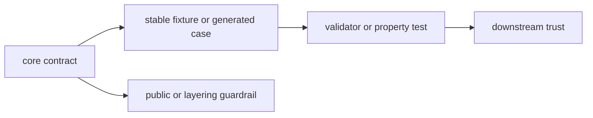

# Tests

This file maps the durable test intent for `bijux-gnss-core`.

## Test Flow



## Entry Points

- `tests/public_api_guardrail.rs` locks the curated public surface discipline.
- `tests/nav_artifact_validation.rs` covers navigation artifact payload validation semantics.
- `tests/tracking_artifact_validation.rs` covers tracking artifact payload validation semantics.
- `tests/prop_timekeeping.rs` property-tests timekeeping and conversion behavior.
- `tests/integration_guardrails.rs` exercises workspace guardrail expectations for this crate.

## Stable Fixtures

- `tests/data/obs_fixture.jsonl` is a shared observation-artifact fixture used by validation paths.
- `tests/prop_timekeeping.proptest-regressions` preserves known counterexamples for timekeeping
  property tests.

## Protection Matrix

| proof family | protects |
| --- | --- |
| public API guardrail | curated exports through `api.rs` |
| artifact validation | semantic payload coherence, not only parse shape |
| timekeeping properties | GPS, UTC, TAI, and sample-time conversions |
| workspace guardrails | dependency direction and boundary discipline |
| stable fixtures | serialized contract compatibility |

- `api.rs` remains the only deliberate public export surface.
- artifact validators reject incoherent payloads instead of silently accepting them
- foundational time and unit behavior stays stable under edge-case inputs
- the crate remains aligned with workspace layering and policy rules
- serialized contract families continue to round-trip through stable artifact-validation fixtures

## Verification

Useful narrow commands from the repository root:

```sh
cargo test -p bijux-gnss-core --test public_api_guardrail
cargo test -p bijux-gnss-core --test nav_artifact_validation
cargo test -p bijux-gnss-core --test tracking_artifact_validation
cargo test -p bijux-gnss-core --test prop_timekeeping
```

## Review Checks

- Does the changed contract have a direct proof?
- Does a serialized fixture need to move with the change?
- Would a downstream crate see a different meaning even if Rust types still
  compile?
