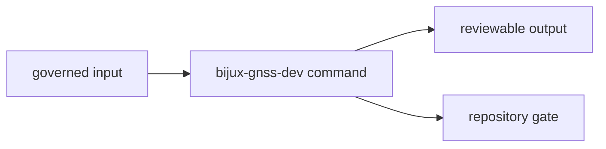

# bijux-gnss-dev

`bijux-gnss-dev` owns maintainer tooling for repository governance. It is a
binary crate, not a reusable product library.

Start here when the question is about audit allowlists, deny-policy deviations,
benchmark comparison, governed inputs, output evidence, or test-lane selection.
Do not start here for product CLI behavior, receiver science, navigation
models, or general shell helpers that have no durable repository owner.

## Reader Route

| question | go next |
| --- | --- |
| Which maintainer command exists? | [docs/COMMANDS.md](docs/COMMANDS.md), `src/main.rs` |
| Which governed input file is validated? | [docs/GOVERNANCE_FILES.md](docs/GOVERNANCE_FILES.md), [docs/AUDIT_POLICY.md](docs/AUDIT_POLICY.md) |
| Where does maintenance evidence go? | [docs/OUTPUTS.md](docs/OUTPUTS.md), [docs/BENCHMARKS.md](docs/BENCHMARKS.md) |
| How are fast and slow test lanes protected? | [docs/TESTS.md](docs/TESTS.md), `tests/integration_nextest_suite_selection.rs` |
| What changed in this package? | [CHANGELOG.md](CHANGELOG.md) |

## Owned Boundary

- quality gates for `audit-allowlist.toml`
- quality gates for `configs/rust/deny.deviations.toml`
- derived `cargo audit --ignore ...` arguments from the reviewed allowlist
- benchmark comparison workflows and repository-scoped evidence outputs
- slow-test roster and nextest lane-selection guardrails

This crate does not own operator-facing product commands, GNSS science,
receiver execution, or general-purpose shell helpers with no durable repository
owner.



## Source Map

- `src/main.rs` owns subcommand parsing, repository-file validation, benchmark
  execution, and baseline comparison.
- `tests/integration_guardrails.rs` verifies the crate still fits workspace
  structure rules.
- `tests/integration_nextest_suite_selection.rs` verifies slow-roster and
  nextest expression selection policy.

## Documentation Map

- [docs/ARCHITECTURE.md](docs/ARCHITECTURE.md)
- [docs/AUDIT_POLICY.md](docs/AUDIT_POLICY.md)
- [docs/BENCHMARKS.md](docs/BENCHMARKS.md)
- [docs/BOUNDARY.md](docs/BOUNDARY.md)
- [docs/COMMANDS.md](docs/COMMANDS.md)
- [docs/CONTRACTS.md](docs/CONTRACTS.md)
- [docs/GOVERNANCE_FILES.md](docs/GOVERNANCE_FILES.md)
- [docs/OUTPUTS.md](docs/OUTPUTS.md)
- [docs/PUBLIC_API.md](docs/PUBLIC_API.md)
- [docs/TESTS.md](docs/TESTS.md)
- [docs/WORKFLOWS.md](docs/WORKFLOWS.md)

## Verification Focus

Use governance checks that match the changed input or command:

```sh
cargo test -p bijux-gnss-dev --test integration_guardrails
cargo test -p bijux-gnss-dev --test integration_nextest_suite_selection
cargo run -p bijux-gnss-dev -- audit-allowlist
cargo run -p bijux-gnss-dev -- deny-policy-deviations
```

Repository-wide lanes and package routing are documented in
[../../README.md](../../README.md).
