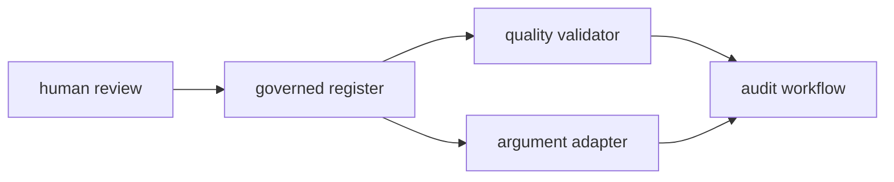
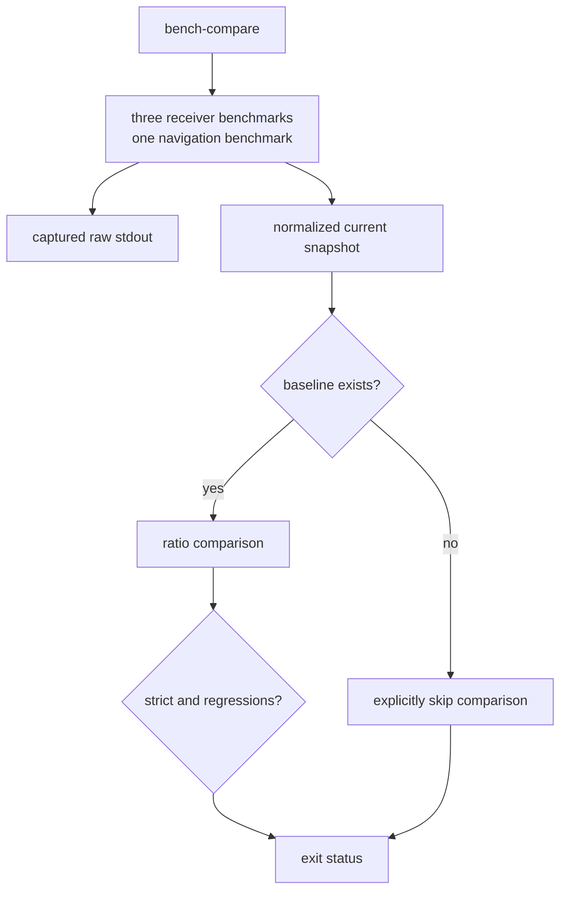

# bijux-gnss-dev

`bijux-gnss-dev` is the repository-only maintenance binary for bijux-gnss.
It validates reviewed exception records, derives Cargo audit arguments, and
captures a curated benchmark snapshot. It is not a GNSS library, does not ship
with the public crates, and does not make governance decisions for reviewers.

Run it from the repository root. The binary does not search parent directories:
without `--workspace-root`, the current directory is the root used to resolve
every governed input and output.

## Four Commands, Four Narrow Contracts

| Command | What success means |
| --- | --- |
| `audit-allowlist` | every current advisory row has a valid identifier, rationale, owner, HTTP review link, and non-expired date |
| `audit-ignore-args` | valid advisory identifiers were sorted, deduplicated, and rendered as Cargo audit arguments |
| `deny-policy-deviations` | every local dependency-policy deviation is identified, owned, explained, linked to shared-standards review, and not expired |
| `bench-compare` | the curated benchmarks ran and a current snapshot was written; comparison passed only if a baseline existed |

```console
cargo run -p bijux-gnss-dev -- audit-allowlist
cargo run -p bijux-gnss-dev -- audit-ignore-args
cargo run -p bijux-gnss-dev -- deny-policy-deviations
cargo run -p bijux-gnss-dev -- bench-compare
```

The [command reference](docs/COMMANDS.md) records arguments and the
[workflow guide](docs/WORKFLOWS.md) shows how repository automation composes
them.

## Validation And Derivation Are Different



`audit-allowlist` is the quality gate. It validates only current `[[advisory]]`
rows. An empty current register is valid, but a missing register is an error.

`audit-ignore-args` is deliberately narrower. It accepts valid identifiers from
current advisory rows and the legacy ignore array, omits malformed identifiers,
sorts and deduplicates the rest, and prints command-line arguments. If the
register is missing, it succeeds without arguments. It does not validate owner,
rationale, review link, or expiry.

The repository audit workflow must therefore run validation before consuming
derived arguments. Treating adapter success as policy approval would bypass the
quality contract. The [audit policy guide](docs/AUDIT_POLICY.md) explains the
two-step boundary.

`deny-policy-deviations` validates the local deviation register. It requires an
identity, owner, reason, non-expired date, and an HTTP review link that names
the shared standards repository. It does not execute the dependency-policy
engine and cannot decide whether the deviation should be accepted.

## Read Benchmark Success Precisely



The default regression ratio is `1.10`. `--threshold <ratio>` changes it, and
`--strict` turns detected regressions into failure. Strict mode does not fail
merely because the baseline is absent.

There is currently no maintained baseline in the repository. In this state, a
green command proves execution and snapshot creation, not performance
regression acceptance. The [benchmark interpretation guide](docs/BENCHMARKS.md)
identifies the benchmark set, output format, and limits of the comparison.

Benchmark comparison is the only current command that creates directories,
starts Cargo child processes, and writes files. The validators are read-only
apart from stdout and diagnostics. The [output contract](docs/OUTPUTS.md)
distinguishes local evidence from any reviewed snapshot location.

## The Slow-Test Proof Lives Beside The Binary

This package also contains the integration test that protects fast and slow
nextest selection. It checks roster ordering and uniqueness, resolves entries
to real tests, and verifies that the fast expression negates the exact slow
expression.

That proof is not a `bijux-gnss-dev` subcommand. It executes the repository’s
lane-expression generator as test evidence. The
[test evidence guide](docs/TESTS.md) explains this package boundary and the
[repository test policy](../../docs/bijux-gnss-dev/quality/repository-test-policy.md)
defines the governed lanes.

## Change The Smallest Authority

- Change this binary for command parsing, validation rules, derivation
  behavior, benchmark execution, normalization, and exit status.
- Change the reviewed register when an exception record changes.
- Change shared standards when the dependency policy itself changes.
- Change the lane generator or slow roster where nextest selection is owned.
- Keep operator GNSS workflows, product artifacts, and scientific algorithms
  out of this package.

Reader-visible maintenance behavior belongs in the
[package release history](CHANGELOG.md). The
[architecture guide](docs/ARCHITECTURE.md) covers child processes and
repository effects; the [governed-input guide](docs/GOVERNANCE_FILES.md)
defines each record this binary reads.
