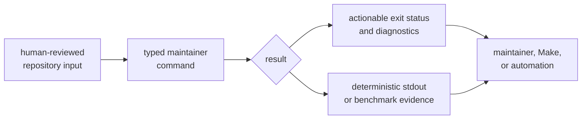
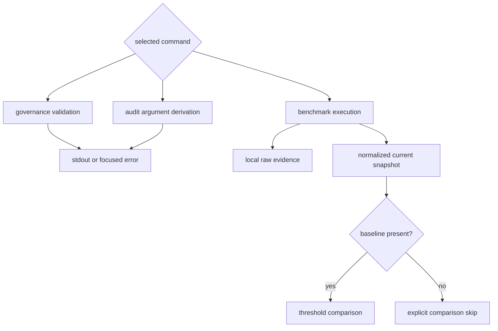

# bijux-gnss-dev

`bijux-gnss-dev` is the repository-maintenance binary for bijux-telecom. It
turns a small set of reviewed governance rules into commands that maintainers
and automation can run the same way. It is not a GNSS library and is not
published.

Use it to validate security exceptions, validate local dependency-policy
deviations, derive Cargo audit arguments, or collect the repository's curated
benchmark evidence.

## Choose A Command

| need | command | effect |
| --- | --- | --- |
| Check that every security advisory exception is identified, explained, owned, linked, and unexpired | `audit-allowlist` | reads the [audit exception register](../../audit-allowlist.toml) and returns pass or failure |
| Check that every local dependency-policy deviation is owned, explained, reviewed upstream, and unexpired | `deny-policy-deviations` | reads the [dependency-policy deviation register](../../configs/rust/deny.deviations.toml) and returns pass or failure |
| Produce the allowed `cargo audit --ignore` arguments | `audit-ignore-args` | writes a sorted, deduplicated argument list to stdout |
| Run the curated receiver and navigation microbenchmarks | `bench-compare` | writes raw and normalized benchmark evidence, then compares it when a baseline exists |

Run commands from the repository root:

```console
cargo run -p bijux-gnss-dev -- audit-allowlist
cargo run -p bijux-gnss-dev -- deny-policy-deviations
cargo run -p bijux-gnss-dev -- audit-ignore-args
cargo run -p bijux-gnss-dev -- bench-compare
```

Use `--workspace-root <path>` only when the process is started outside the
repository root. It changes where the command resolves governed inputs and
outputs; it does not select a different policy.

## Understand The Trust Chain



The binary validates record quality and performs deterministic derivation. It
does not decide whether a vulnerability is acceptable, approve an exception,
or define shared dependency policy. Those remain review decisions.

### Audit Exceptions

`audit-allowlist` rejects malformed advisory identifiers, missing rationale or
owner, non-HTTP review links, malformed dates, and dates earlier than the
current day. An empty exception register is valid.

`audit-ignore-args` is an adapter for Cargo audit invocation. It emits only
syntactically valid advisory identifiers and supports both of the register
shapes understood by repository automation. It does not independently enforce
owner, rationale, link, or expiry quality. Run `audit-allowlist` first; the
repository audit workflow intentionally does both.

If the exception register is absent, `audit-ignore-args` emits an empty line and
succeeds. The validator treats the same absence as an error. This asymmetry
lets callers form a command line safely while preserving a separate governance
gate.

### Dependency-Policy Deviations

`deny-policy-deviations` requires every local deviation to carry an identity,
owner, reason, future or current expiry, and HTTP review link that references
the shared standards repository. The command validates the local exception
record; it does not run the dependency-policy engine itself.

Use the [audit policy guide](docs/AUDIT_POLICY.md) and
[governance input guide](docs/GOVERNANCE_FILES.md) when editing these records.

### Benchmark Comparison

`bench-compare` runs three receiver microbenchmarks and one navigation-filter
microbenchmark, stores their captured stdout, and writes a normalized current
snapshot. Benchmark stderr remains console output. If a maintained baseline
exists, the command reports measurements whose current-to-baseline ratio
exceeds the configured threshold.

`--strict` turns reported regressions into a failing exit status.
`--threshold <ratio>` changes the comparison ratio; the default is `1.10`.

There is currently no maintained baseline in the repository. In that state the
command explicitly skips comparison, including in strict mode. A successful
run proves that the benchmark set executed and evidence was written; it does
not prove that performance passed a regression gate. See the
[benchmark guide](docs/BENCHMARKS.md) and
[receiver performance guide](../../docs/05-bijux-gnss-receiver/operations/performance-and-profiling.md)
before interpreting a result.

## Slow-Test Policy

This package contains the integration proof for fast and slow nextest lane
selection. The proof checks that:

- the governed slow roster is sorted and unique;
- every roster entry resolves to a real Rust test function;
- explicitly slow-namespaced tests are not duplicated in the roster;
- the generated slow expression contains every roster entry;
- the fast expression negates the exact slow expression.

The binary does not generate those lane expressions. The
[suite-selection proof](tests/integration_nextest_suite_selection.rs) executes
the repository's expression generator and verifies the relationship. Use the
[test guide](docs/TESTS.md) for the boundary between command tests and
repository lane policy.

## Effects And Outputs

The three governance commands are read-only apart from stdout. Benchmark
comparison is the only current command that creates directories, starts child
processes, and writes evidence.



The [output contract](docs/OUTPUTS.md) describes evidence ownership and the
[workflow guide](docs/WORKFLOWS.md) explains how commands are composed by
repository automation.

## Package Boundary

This package owns:

- command parsing and exit behavior for its four maintainer workflows;
- validation of repository-local governance records;
- derivation of audit-ignore arguments from the reviewed register;
- execution, normalization, and optional comparison of the curated benchmark
  set;
- integration evidence for slow-test roster and lane-expression coherence.

It does not own:

- operator-facing GNSS commands or reports;
- signal, receiver, or navigation algorithms;
- shared standards policy;
- generic scripts with no durable repository-governance responsibility;
- product runtime artifacts or dataset storage.

The [architecture guide](docs/ARCHITECTURE.md) explains this boundary. The
[command source](src/main.rs) is the implementation authority, and the
[package changelog](CHANGELOG.md) records user-visible package changes.

## Documentation

- [Command reference](docs/COMMANDS.md)
- [Workflow behavior](docs/WORKFLOWS.md)
- [Governed inputs](docs/GOVERNANCE_FILES.md)
- [Output contract](docs/OUTPUTS.md)
- [Benchmark interpretation](docs/BENCHMARKS.md)
- [Architecture](docs/ARCHITECTURE.md)
- [Boundary rules](docs/BOUNDARY.md)
- [Command contracts](docs/CONTRACTS.md)
- [Test evidence](docs/TESTS.md)
- [Repository package map](../../README.md)
