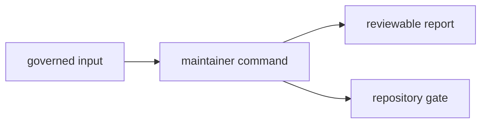

# Architecture

`bijux-gnss-dev` is a single-binary maintainer tooling crate. It does not expose
a reusable Rust library; it keeps repository governance, slow-test selection,
and benchmark hygiene explicit enough to run locally and in automation.

## Architecture Flow

## Source Map

- `src/main.rs` defines the command-line parser, subcommand inventory, and all execution paths.

The crate is compact because every command operates on repository files and
shared workspace conventions. If it grows, it should split by owned workflow:
audit policy, deny-policy deviations, benchmark comparison, or test-lane
selection.

## Command Families

- `AuditAllowlist` validates the shape and freshness of `audit-allowlist.toml`.
- `DenyPolicyDeviations` validates governance rules in `configs/rust/deny.deviations.toml`.
- `AuditIgnoreArgs` converts the reviewed allowlist into `cargo audit --ignore ...` arguments.
- `BenchCompare` runs workspace benchmarks, records outputs under `artifacts/`, and compares the
  results against the checked-in baseline.

## Test Map

- `tests/integration_guardrails.rs` ensures the crate still satisfies workspace guardrails.
- `tests/integration_nextest_suite_selection.rs` proves the slow-test roster
  resolves to real tests and feeds fast/slow nextest expressions.

## Design Constraints

- Commands must stay repository-owned and deterministic enough for CI and local maintainer use.
- Generated outputs belong under `artifacts/` or another explicitly governed repository location.
- If a command starts owning product behavior rather than maintainer behavior, it belongs in another
  crate.

## Review Checks

- Which governed input or output changed?
- Does the command fail with a maintainer-actionable message?
- Does the change keep product behavior outside the maintainer tooling crate?
