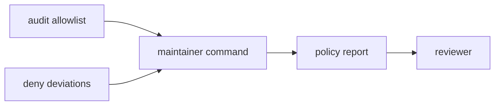

# Audit Policy

`bijux-gnss-dev` owns repository policy around controlled security and standards
exceptions. These exceptions are not casual configuration: they document why the
repository is allowed to proceed when a normal security or standards gate would
reject a dependency or setting.

## Audit Flow

## Owned Policy Checks

| surface | check |
| --- | --- |
| `audit-allowlist.toml` | Validates quality, ownership, reason, and expiry discipline for security advisory exceptions. |
| `configs/rust/deny.deviations.toml` | Validates ownership, review link, and expiry discipline for standards deviations. |
| derived audit arguments | Builds `cargo audit --ignore ...` arguments only from reviewed allowlist entries. |

## Contract Rules

- Every exception needs a reason that remains understandable after the original
  review conversation is gone.
- Exceptions need an owner and expiry or review path.
- Derived audit arguments must come from reviewed allowlist data, not hand-built
  command strings.
- This crate enforces repository policy over exception files; it does not own
  third-party advisories or upstream standards decisions.

## Review Checks

- A new allowlist entry must explain why the risk is accepted.
- A changed deviation must preserve owner and review-link accountability.
- Expired or ownerless entries should fail loudly, not degrade into warnings
  that are easy to ignore.
