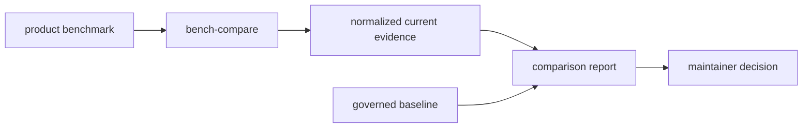

# Benchmarks

`bijux-gnss-dev` does not own benchmark definitions, but it does own benchmark
governance. The product crates decide what to measure; the dev crate decides how
maintainers compare current evidence to the governed baseline.

## Benchmark Governance Flow

## Governed Surface

| surface | responsibility |
| --- | --- |
| curated benchmark package set | Names which product benchmark groups are compared by the maintainer command. |
| normalized snapshot extraction | Converts bencher output into stable comparison evidence. |
| `artifacts/` evidence emission | Keeps current-run evidence in the repository-owned run-output location. |
| `benchmarks/bencher_baseline.txt` | Stores the maintained comparison baseline. |
| strict-mode threshold | Fails when regressions exceed the configured tolerance. |

## Boundary Rules

- Benchmark code belongs in the product crate that owns the measured behavior.
- Receiver or navigation performance semantics belong to those crates, not to
  dev tooling.
- Permanent storage policy outside governed benchmark locations belongs to
  repository workflow docs.
- A benchmark comparison is evidence for review; it is not proof that scientific
  behavior is correct.

## Review Checks

- If the curated benchmark set changes, update this file and workflow docs in
  the same change.
- Baseline changes need a reason a maintainer can review later.
- Strict-mode threshold changes need the tradeoff stated: noise tolerance versus
  regression sensitivity.
