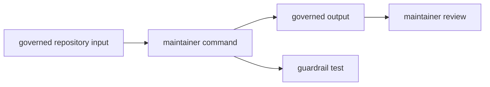

# Boundary

Owner: maintainer tooling for the GNSS repository

`bijux-gnss-dev` owns repository-maintenance commands and the policies they
enforce. It is allowed to read governed files and write governed evidence, but
it must not become an indirect product runtime.

## Boundary Flow

## Owned Scope

`bijux-gnss-dev` owns repository maintenance workflows implemented as typed commands:

- audit allowlist validation
- deny-policy governance validation
- derived `cargo audit` ignore arguments
- benchmark comparison and benchmark evidence emission
- slow-test roster and nextest lane-selection validation

## What this crate must own

- command-line parsing for maintainer-only commands
- repository-file validation logic for the workflows above
- benchmark comparison logic that belongs to repository maintenance rather than product execution
- explicit artifact writing for benchmark evidence

## What this crate must not own

- product CLI behavior for operators
- GNSS signal processing, navigation estimation, or receiver orchestration
- generic repository scripting that has no stable owner
- hidden writes outside governed output locations

## Dependency Rule

This crate should depend only on general-purpose libraries and policy crates
needed to perform its maintainer workflow. It should not pull product crates
into scope to reach around typed interfaces.

## Effect Model

This crate is allowed to read repository files, print diagnostics, and write benchmark artifacts.
Those effects are the point of the crate, but they must remain explicit and repository-scoped.

## Review Checks

- Which governed file, output, or lane-selection rule changed?
- Does the command fail with enough context for a maintainer to repair the
  repository input?
- Is product behavior still owned by product crates?
