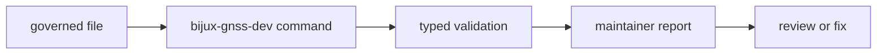

# Governance Files

`bijux-gnss-dev` keeps selected repository control files governed by typed
maintainer commands. These files represent security exceptions, standards
deviations, benchmark evidence, and test-lane policy that can become silent debt
if they are only remembered by convention.

## Governance Flow

## Owned Files

| file | why it is governed |
| --- | --- |
| `audit-allowlist.toml` | Security advisory exceptions need owner, reason, and expiry discipline. |
| `configs/rust/deny.deviations.toml` | Standards deviations need review links and expiration so exceptions do not become defaults. |
| `benchmarks/bencher_baseline.txt` | Benchmark comparison evidence needs a maintained baseline and stable interpretation. |
| `configs/rust/nextest-slow-roster.txt` | Slow-test selection needs a curated roster that keeps fast tests useful without losing proof coverage. |

## Ownership Rules

- This crate does not own every repository config file.
- A file belongs here when it needs typed validation or derived maintainer
  command behavior.
- Governed files must stay reviewable from source, not hidden behind generated
  state.
- New governed files need docs, command behavior, and tests in the same change
  set.

## Review Checks

- Does each exception record have an owner, reason, and expiry or review path?
- Does a new governed file have a command or test that proves its contract?
- Can a maintainer understand the report without reading `src/main.rs` first?
