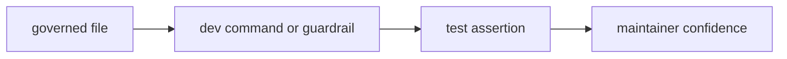

# Tests

`bijux-gnss-dev` tests protect maintainer tooling and repository governance.
Most product behavior is tested in the product crates; this package proves that
maintenance commands, governed files, and test-lane policy remain trustworthy.

## Test Flow

## Entry Points

| entrypoint | protects |
| --- | --- |
| `tests/integration_guardrails.rs` | The dev crate itself still satisfies workspace guardrail policy. |
| `tests/integration_nextest_suite_selection.rs` | Slow-test roster entries resolve to real tests and feed fast/slow nextest expressions correctly. |
| `cargo run -p bijux-gnss-dev -- audit-allowlist` | Security allowlist entries remain reviewed and usable by audit tooling. |
| `cargo run -p bijux-gnss-dev -- deny-policy-deviations` | Standards deviations remain owned, reviewed, and bounded. |

## Contract Rules

- Tests should prove maintained repository behavior, not private formatting.
- Slow-lane tests belong in the governed roster when they exceed the fast-lane
  budget or represent broad proof evidence.
- Command tests should prefer concrete governed files and reports over mocks that
  do not exercise maintainer workflows.
- Product runtime and scientific correctness stay in product crate tests.

## Review Checks

- If a new maintainer command is added, add a test or documented manual command
  that proves its contract.
- If a new governed file is introduced, list it in
  [governance file guide](GOVERNANCE_FILES.md).
- If test-lane policy changes, prove both inclusion in the slow lane and
  exclusion from the fast lane.
