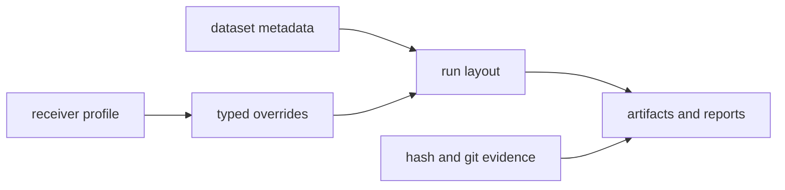

# bijux-gnss-infra API

`bijux-gnss-infra` exposes repository infrastructure used by CLI workflows and
validation tooling. The public API is about governed inputs and outputs:
datasets, run layout, manifests, reference validation, hashes, experiment
sweeps, and typed receiver-profile overrides.

## API Map

| family | representative items | contract owned here |
| --- | --- | --- |
| artifacts | `artifact_validate`, `artifact_explain`, `ArtifactValidationResult`, `ArtifactExplainResult` | Read persisted GNSS artifacts and return reviewable validation or explanation records. |
| run layout | `RunContextArgs`, `RunDirectoryLayout`, `run_dir`, `artifacts_dir`, `write_manifest`, `write_run_report` | Place run outputs under deterministic repository-owned paths with manifest and report metadata. |
| datasets | `DatasetRegistry`, `DatasetEntry`, `RecordedCaptureProvenance`, `load_raw_iq_metadata`, `resolve_raw_iq_metadata`, `parse_ecef` | Interpret checked-in dataset metadata and raw-IQ sidecars without embedding command-specific policy. |
| experiments | `ExperimentSpec`, `SweepParameter`, `parse_sweep`, `expand_sweep` | Turn reviewable sweep configuration into concrete run inputs. |
| overrides | `CommonOverrides`, `apply_overrides`, `apply_common_overrides`, `apply_sweep_value` | Apply typed repository overrides to receiver profiles. |
| provenance | `hash_config`, `git_hash`, `git_dirty`, `cpu_features` | Capture reproducibility evidence for runs and reports. |
| validation bridge | `validate_reference`, reference comparison exports, nav validation exports behind feature `nav` | Let infrastructure workflows compare outputs without taking ownership of receiver or navigation science. |

## Re-Export Policy

The `receiver`, `core`, `signal`, and feature-gated `nav` re-exports exist for
CLI convenience. They do not make infra the owner of those APIs. If a caller is
writing scientific logic or receiver runtime logic, import the owning crate
directly instead of routing through infra.

## Boundary Rules

- Infra may decide where repository evidence lives; it must not decide whether a
  receiver acquisition or navigation solution is scientifically correct.
- Dataset and raw-IQ metadata handling must stay typed and deterministic.
- Override application must preserve receiver configuration validation rather
  than mutating unstructured maps.
- Hash and git helpers provide evidence. They must not silently hide dirty or
  missing provenance.

## Review Checks

- New exports need a repository workflow, artifact, dataset, validation, or run
  layout use case.
- Add documentation when a new output path, sidecar file, or manifest field is
  introduced.
- Keep feature-gated navigation validation visible so non-navigation builds do
  not appear to support unavailable surfaces.
