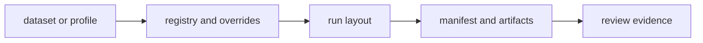

# bijux-gnss-infra

[](https://crates.io/crates/bijux-gnss-infra)
[](https://github.com/bijux/bijux-telecom/blob/main/LICENSE)
[](https://github.com/bijux/bijux-telecom)
[](https://crates.io/crates/bijux-gnss-infra)
[](https://github.com/bijux/bijux-telecom/pkgs/container/bijux-telecom%2Fbijux-gnss-infra)
[](https://docs.rs/bijux-gnss-infra/latest/bijux_gnss_infra/)
[](https://github.com/bijux/bijux-telecom/tree/main/docs/03-bijux-gnss-infra)

`bijux-gnss-infra` owns repository-side infrastructure: dataset registry,
run identity, persisted artifact layout, provenance hashing, receiver-profile
overrides, and experiment sweep expansion.

Use this crate when an input must become a governed repository object or runtime
evidence must remain interpretable after the producing command exits.
Acquisition science, signal math, navigation estimation, and operator wording
remain with their owning crates.

## Availability

The first registry release has not been published. In this workspace, build or
test the package directly:

```sh
cargo test -p bijux-gnss-infra
```

After publication, add it with `cargo add bijux-gnss-infra`. The Cargo package
name is `bijux-gnss-infra`; its Rust import name is `bijux_gnss_infra`. All
public packages in this repository share one release version.

## Choose the Repository Contract

| question | go next |
| --- | --- |
| Which dataset facts and raw-IQ sidecars are trusted? | [dataset guide](docs/DATASETS.md) |
| How are run identity, directories, manifests, reports, and history defined? | [run-layout guide](docs/RUN_LAYOUT.md) |
| How are provenance and content identities computed? | [hashing guide](docs/HASHING.md) |
| How do overrides and sweeps expand? | [Override guide](docs/OVERRIDES.md), [Experiment guide](docs/EXPERIMENTS.md) |
| How are artifacts inspected and reference results adapted? | [validation guide](docs/VALIDATION.md) |
| What compatibility changed? | [package release history](CHANGELOG.md) |

## Owned Boundary

- dataset registration and metadata interpretation
- deterministic run-directory layout and manifest persistence
- artifact inspection and validation adapters
- receiver-profile overrides and experiment sweep expansion
- provenance hashing helpers for repository-owned inputs and outputs

This crate does not own receiver execution algorithms, signal generation,
navigation estimation, or operator-facing report language.



## Durability Contract

- Dataset resolution preserves capture location, sample metadata, station
  coordinates, and provenance without guessing missing scientific facts.
- The same declared run identity resolves to the same repository footprint.
- Manifests, reports, histories, and artifact summaries remain understandable
  after the command version that wrote them has changed.
- Hash inputs and algorithms are explicit enough to explain why two provenance
  identities match or differ.
- Overrides and experiment sweeps expand typed fields deterministically.
- Inspection validates artifact meaning and schema policy without reimplementing
  receiver or navigation science.

The [infrastructure release guide](../../docs/03-bijux-gnss-infra/operations/release-and-versioning.md)
defines compatibility treatment for persisted fields, dataset interpretation,
hashes, and run footprints.

## Features

| feature | effect |
| --- | --- |
| `nav` | enables navigation-aware receiver infrastructure |
| `precise-products` | forwards precise-product support through the receiver boundary |
| `tracing` | forwards receiver tracing support |

Navigation-aware infrastructure is enabled by default.

## Implementation Ownership

- The [dataset boundary](src/datasets/mod.rs) owns registry entries, raw-IQ
  sidecars, loading, validation, and path resolution.
- The [run-layout boundary](src/run_layout.rs) owns run identity, directories,
  paths, persistence, provenance, manifests, reports, and history.
- The [artifact inspector](src/artifact_inspection/mod.rs) owns type-aware
  summaries, schema policy, and validation adapters.
- The [override boundary](src/overrides/mod.rs) and
  [sweep expansion](src/sweep.rs) own typed experiment variation.
- The [provenance hasher](src/hash/mod.rs) owns content identity.
- The [reference adapter](src/validate_reference.rs) bridges persisted inputs to
  validation without owning scientific truth.
- The [public API](src/api.rs) owns deliberate downstream exports.

For package architecture and contracts, continue with the
[architecture guide](docs/ARCHITECTURE.md), [boundary guide](docs/BOUNDARY.md),
[contract guide](docs/CONTRACTS.md), and [public API guide](docs/PUBLIC_API.md).
The [test guide](docs/TESTS.md) maps persistence and inspection behavior to
proof.

## Verification Focus

Use infra tests when changing repository semantics:

```sh
cargo test -p bijux-gnss-infra --test integration_overrides
cargo test -p bijux-gnss-infra --test integration_guardrails
```

Repository-wide lanes and package routing are documented in the
[workspace README](../../README.md).
