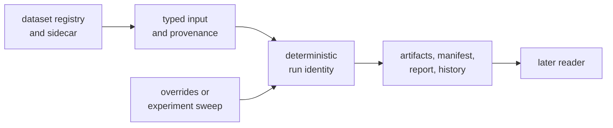

# bijux-gnss-infra

`bijux-gnss-infra` makes GNSS inputs and outputs reproducible at the repository
boundary. It resolves registered datasets, records provenance, derives run
locations, writes manifests and reports, applies typed configuration
overrides, expands experiment sweeps, and inspects persisted artifacts.

Use it when evidence must still be understandable after the process that
created it has exited. It does not decide whether an acquisition is valid,
which correction model is scientific, or how an operator-facing report should
be worded.

## From Input Identity To Reviewable Run

Infrastructure preserves what was selected, how it was varied, where evidence
was written, and enough provenance to explain the run later. The receiver and
navigation packages remain the authorities for the scientific payload inside
that evidence.

## Choose The Durable Contract

| You are working with... | Read first |
| --- | --- |
| registered captures, station coordinates, raw-IQ sidecars, or source provenance | [Dataset resolution](docs/DATASETS.md) |
| deterministic directories, manifests, reports, or append-only history | [Run layout](docs/RUN_LAYOUT.md) |
| configuration or input content identity | [Provenance hashing](docs/HASHING.md) |
| typed one-run configuration changes | [Override semantics](docs/OVERRIDES.md) |
| Cartesian expansion of controlled variations | [Experiment sweeps](docs/EXPERIMENTS.md) |
| persisted artifact explanation or validation adaptation | [Artifact inspection](docs/VALIDATION.md) |
| supported downstream exports | [Public API](docs/PUBLIC_API.md) |

The public API exposes these infrastructure families and re-exports receiver,
core, signal, and optional navigation APIs for command integration. Consumers
that only need receiver or scientific behavior should depend on the owning
package directly rather than treating infrastructure as a universal facade.

## Do Not Guess Missing Dataset Facts

A dataset entry is more than a file location. A resolved capture may carry
sample format, sample rate, intermediate frequency, capture time, byte offset,
station coordinates, and recorded-capture provenance. Infrastructure may parse
and preserve those declarations; it must not invent them from a receiver
profile or filename.

Signal owns the types that describe raw samples. Infrastructure owns loading a
sidecar and associating it with a registered input. The receiver owns decoding
and processing the resulting stream. Keeping those responsibilities separate
prevents a convenient local default from becoming false capture metadata.

## Treat Paths And Manifests As Public Behavior

Callers should derive locations through `RunContextArgs` and
`RunDirectoryLayout`, then use the provided manifest, report, and history
writers. Building paths or record shapes by hand forks the persistence
contract.

Review a run-layout change for:

- deterministic output for the same declared run identity;
- explicit schema and provenance fields;
- old manifests and reports that remain interpretable;
- stable history append behavior;
- clear separation between transient command output and durable evidence;
- generated output remaining under its governed repository location.

Receiver `RunArtifacts` are in-memory scientific results. They become durable
repository evidence only when a caller persists them with an explicit run
context and manifest. The [receiver package](../bijux-gnss-receiver/README.md)
documents the payload side of this boundary.

## Feature Forwarding

Navigation-aware infrastructure is enabled by default.

| Feature | Forwarded behavior |
| --- | --- |
| `nav` | enables navigation support through the receiver dependency |
| `precise-products` | enables receiver precise-product forwarding |
| `tracing` | enables receiver tracing forwarding |

These features integrate lower packages; they do not transfer ownership of
navigation science or receiver runtime behavior into infrastructure.

The first registry release has not been published. The prepared Cargo package
name is `bijux-gnss-infra`, and the Rust import name is
`bijux_gnss_infra`.

Use the [test evidence guide](docs/TESTS.md) to match dataset, persistence,
hashing, override, sweep, and inspection changes with focused proof.
Compatibility changes belong in the [package release history](CHANGELOG.md)
and follow the [infrastructure release guide](../../docs/03-bijux-gnss-infra/operations/release-and-versioning.md).
