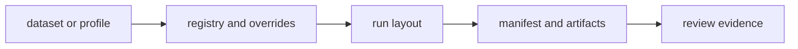

# bijux-gnss-infra

`bijux-gnss-infra` owns repository-side infrastructure: dataset registry,
run identity, persisted artifact layout, provenance hashing, receiver-profile
overrides, and experiment sweep expansion.

Start here when a reader needs to understand how an input becomes a governed
repository object or how a command writes reviewable evidence to disk. Do not
start here for acquisition science, signal-code math, navigation estimation, or
operator report wording.

## Reader Route

| question | go next |
| --- | --- |
| Which dataset metadata is trusted? | [docs/DATASETS.md](docs/DATASETS.md), `src/datasets/` |
| Where should a run write files? | [docs/RUN_LAYOUT.md](docs/RUN_LAYOUT.md), `src/run_layout/` |
| How is provenance or hashing computed? | [docs/HASHING.md](docs/HASHING.md), `src/hash/` |
| How do overrides and sweeps expand? | [docs/OVERRIDES.md](docs/OVERRIDES.md), [docs/EXPERIMENTS.md](docs/EXPERIMENTS.md) |
| What changed in this package? | [CHANGELOG.md](CHANGELOG.md) |

## Owned Boundary

- dataset registration and metadata interpretation
- deterministic run-directory layout and manifest persistence
- artifact inspection and validation adapters
- receiver-profile overrides and experiment sweep expansion
- provenance hashing helpers for repository-owned inputs and outputs

This crate does not own receiver execution algorithms, signal generation,
navigation estimation, or operator-facing report language.



## Source Map

- `src/datasets/` owns dataset registry and raw-IQ sidecar metadata.
- `src/run_layout/` owns run identity, directories, paths, persistence, and
  records.
- `src/artifact_inspection/` owns inspection summaries and validation adapters.
- `src/overrides/` and `src/sweep.rs` own profile override and experiment sweep
  behavior.
- `src/hash/` owns provenance hashing helpers.
- `src/validate_reference.rs` owns infrastructure-side validation adapters.

## Documentation Map

- [docs/ARCHITECTURE.md](docs/ARCHITECTURE.md)
- [docs/BOUNDARY.md](docs/BOUNDARY.md)
- [docs/CONTRACTS.md](docs/CONTRACTS.md)
- [docs/DATASETS.md](docs/DATASETS.md)
- [docs/EXPERIMENTS.md](docs/EXPERIMENTS.md)
- [docs/HASHING.md](docs/HASHING.md)
- [docs/OVERRIDES.md](docs/OVERRIDES.md)
- [docs/PUBLIC_API.md](docs/PUBLIC_API.md)
- [docs/RUN_LAYOUT.md](docs/RUN_LAYOUT.md)
- [docs/TESTS.md](docs/TESTS.md)
- [docs/VALIDATION.md](docs/VALIDATION.md)

## Verification Focus

Use infra tests when changing repository semantics:

```sh
cargo test -p bijux-gnss-infra --test integration_overrides
cargo test -p bijux-gnss-infra --test integration_guardrails
```

Repository-wide lanes and package routing are documented in
[../../README.md](../../README.md).
