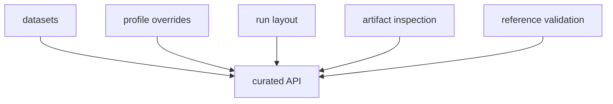

# Architecture

`bijux-gnss-infra` is the infrastructure boundary for the GNSS workspace.

## Architecture Flow

## Source Map

- `src/api.rs` is the curated downstream surface.
- `src/artifact_inspection/` owns artifact validation and explanation workflows.
- `src/commands.rs` owns run-preparation helpers used by higher-level adapters.
- `src/datasets/` owns dataset-registry parsing, raw-IQ metadata loading, and coordinate parsing.
- `src/experiments.rs` plus `src/sweep.rs` own experiment specs and sweep expansion.
- `src/hash/` owns configuration and provenance hashing helpers.
- `src/overrides/` owns typed receiver-profile override application.
- `src/parse/` owns small parsing helpers used by infrastructure workflows.
- `src/run_layout/` owns run identity, directories, manifests, history, and reports.
- `src/validate_reference.rs` owns validation-reference checks and adapters.

## Dependency Direction

This crate may depend on `receiver` and `signal` because it wraps persisted
artifacts, profiles, and validation flows around those contracts. Higher-level
crates such as the CLI and testkit consume this infrastructure surface.

## Test Map

- `tests/integration_overrides.rs` checks infrastructure-owned override application behavior.
- `tests/integration_guardrails.rs` keeps the crate aligned with workspace guardrails.

## Design Constraints

- Filesystem and repository layout rules live here instead of leaking through
  CLI commands.
- Infrastructure helpers expose typed behavior rather than forcing callers to
  manipulate file paths and manifests by hand.
- If a helper only re-exports product behavior without adding an infrastructure
  boundary, it belongs elsewhere.

## Review Checks

- Does the API expose a repository contract rather than a convenience shortcut?
- Does the source location match the artifact, dataset, override, or validation
  responsibility it changes?
- Can a downstream reader trace a persisted output back to typed inputs?
