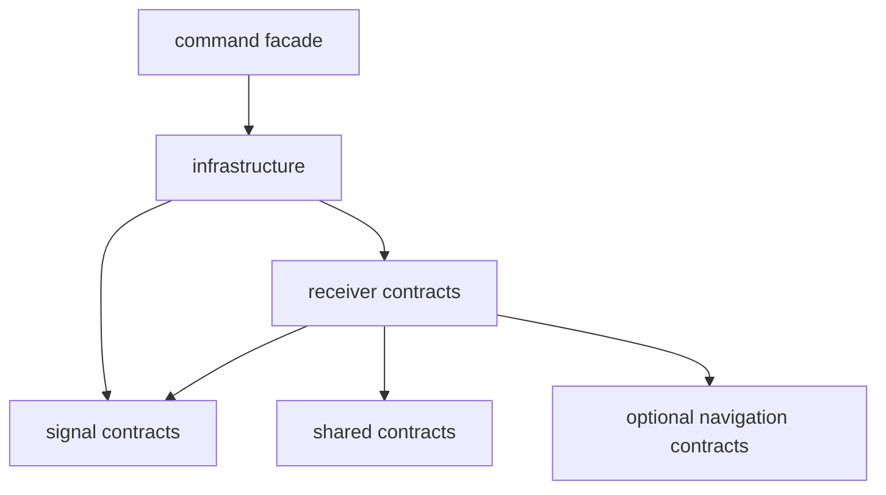

# Architecture

`bijux-gnss-infra` makes repository inputs and outputs deterministic,
typed, and reviewable. It owns dataset interpretation, run identity,
persistence layout, provenance, variant expansion, and artifact inspection. It
does not own receiver or navigation science.

## Repository Evidence Flow

```mermaid
flowchart LR
    inputs["dataset, profile, and run context"]
    resolution["typed resolution and overrides"]
    identity["run identity and provenance"]
    execution["receiver execution"]
    artifacts["typed receiver artifacts"]
    persistence["manifest, report, history, and files"]
    inspection["artifact inspection and reference adapters"]

    inputs --> resolution
    resolution --> identity
    identity --> execution
    execution --> artifacts
    artifacts --> persistence
    persistence --> inspection
```

Receiver execution appears in the flow because infrastructure prepares and
records its boundary. The receiver crate still owns execution behavior.

## Ownership Boundaries

| responsibility | owner |
| --- | --- |
| dataset registry, capture provenance, sidecar loading, and metadata resolution | [dataset boundary](../src/datasets/mod.rs) |
| infrastructure-specific coordinate parsing | [coordinate parser](../src/parse/coordinates.rs) |
| maintained experiment specifications and sweep parameters | [experiment contracts](../src/experiments.rs) |
| deterministic sweep expansion | [sweep expansion](../src/sweep.rs) |
| typed receiver-profile mutation | [override boundary](../src/overrides/mod.rs) |
| configuration and provenance identity | [provenance hashing](../src/hash/mod.rs) |
| run identity, directories, paths, manifests, reports, history, and replay context | [run-layout boundary](../src/run_layout.rs) |
| artifact schema policy, validation, and explanation | [artifact inspection](../src/artifact_inspection/mod.rs) |
| standard run preparation | [run preparation](../src/commands.rs) |
| persisted-evidence adaptation for reference comparison | [reference adapter](../src/validate_reference.rs) |
| supported downstream exports | [curated infrastructure API](../src/api.rs) |

## Dependency Direction

Infrastructure may adapt receiver and signal contracts for persistence, but it
must not duplicate their algorithms. The command facade may select repository
operations, but it must not invent its own run layout or manifest shape.

## Durability Invariants

- The same declared run context resolves to the same identity inputs and
  governed footprint.
- Dataset resolution never guesses sample rate, intermediate frequency, format,
  station coordinates, or provenance.
- Overrides mutate typed configuration fields and reject unsupported names or
  values.
- Manifests and reports remain understandable independently of the command
  process that wrote them.
- Hashing records enough input context to explain equality and difference.
- Artifact inspection applies schema and semantic policy without changing
  scientific meaning.

The [run-layout guide](RUN_LAYOUT.md) defines persisted behavior, while the
[dataset guide](DATASETS.md) and [validation guide](VALIDATION.md) define input
and inspection trust.

## Architectural Evidence

- [Override integration](../tests/integration_overrides.rs) protects typed
  profile mutation.
- [Package guardrails](../tests/integration_guardrails.rs) protect dependency
  and ownership boundaries.
- Module-level tests beside dataset, run-layout, and inspection owners protect
  parsing, identity, persistence, and schema behavior.
