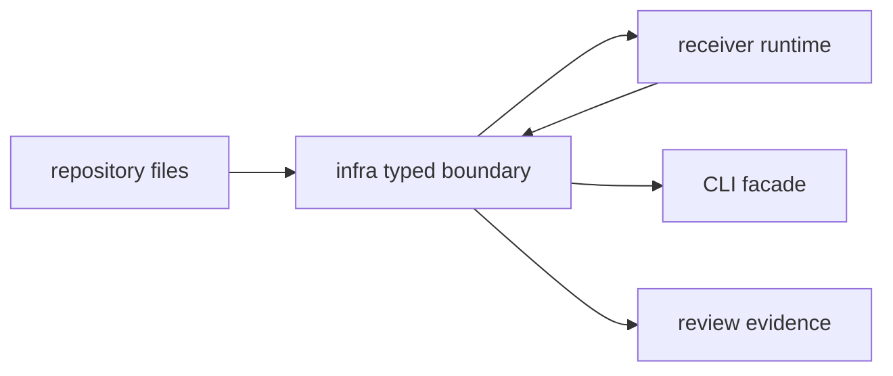

# Boundary

Owner: repository-facing GNSS infrastructure and run-layout mechanics

`bijux-gnss-infra` is where repository state becomes typed enough for receiver,
CLI, validation, and review workflows to share. It owns file-backed inputs and
outputs; it does not own the science that produces GNSS measurements.

## Boundary Flow

## Owned Scope

`bijux-gnss-infra` owns:

- dataset registry and raw-IQ metadata resolution
- run directory identity, manifests, reports, and history
- artifact explanation and validation
- experiment sweep expansion and profile overrides
- validation-reference adapters and infrastructure-friendly API composition

## Out Of Scope

- signal-processing implementations
- navigation-solvers or orbit/atmosphere models
- receiver channel orchestration
- operator command parsing and rendering

## Effect Model

This crate is allowed to touch repository-facing concerns: filesystem paths,
manifests, reports, dataset configs, and artifact payloads. Those effects are
its reason to exist, but they must remain typed and explicit. A caller should be
able to inspect an infra type and know which repository object it represents.

## Dependency Rule

This crate may aggregate lower-level product APIs for infrastructure
convenience, but it should not become a catch-all home for unrelated helpers
that merely lacked a better owner.

## Review Checks

- Does the change interpret repository state, or is it product computation?
- Are filesystem effects explicit in type names, arguments, and reports?
- Can receiver, CLI, and validation callers share the behavior without forking
  path or manifest rules?
