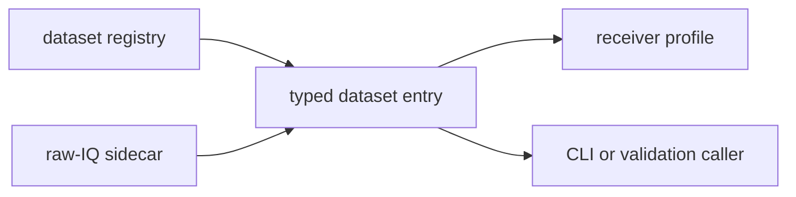

# Datasets

`bijux-gnss-infra` turns repository dataset files into typed inputs. A dataset
entry is not just a path: it carries capture provenance, optional raw-IQ sidecar
metadata, station position, and the lookup rules that higher crates rely on
before receiver execution starts.

## Dataset Flow

## Owned Responsibilities

- `DatasetRegistry` and `DatasetEntry` as the registry contract
- recorded-capture provenance attached to dataset entries
- `parse_ecef` for infrastructure-side coordinate parsing
- raw-IQ sidecar loading through `load_raw_iq_metadata`
- dataset-aware metadata lookup through `resolve_raw_iq_metadata`

## Reader Contract

Dataset resolution is infrastructure state, not receiver science and not CLI
wording. Callers should leave this layer with:

- a deterministic capture location
- typed sample-rate, intermediate-frequency, format, and timestamp metadata
- a station coordinate with explicit parsing behavior
- provenance that can be carried into manifests and reports

If any of those values are guessed by a caller after registry resolution, the
boundary has failed.

## Boundary Rules

- Signal-specific metadata types remain owned by `bijux-gnss-signal`.
- Dataset-driven receiver execution remains owned by `bijux-gnss-receiver`.
- Human-facing dataset command semantics remain owned by `bijux-gnss`.
- Persisted run paths and manifests remain owned by the run-layout layer in
  this crate.

## Review Checks

- Does the dataset entry carry enough provenance for a future reader to
  understand where the capture came from?
- Are raw-IQ sidecar fields parsed once here instead of being reinterpreted by
  command or receiver code?
- Does an error explain the missing or inconsistent dataset field rather than
  leaking a low-level parse failure?
