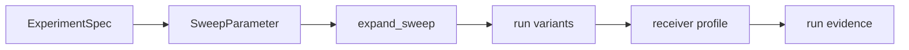

# Experiments

`bijux-gnss-infra` owns repository-facing experiment and sweep descriptions for
batch runs. Experiments describe how one maintained configuration becomes a set
of reproducible variants; they do not decide the scientific meaning of receiver
parameters.

## Experiment Flow

## Owned Surface

| item | responsibility |
| --- | --- |
| `ExperimentSpec` | Captures the repository-level description of a repeatable experiment. |
| `SweepParameter` | Describes one controlled axis that can become multiple run variants. |
| `parse_sweep` | Parses reviewable sweep syntax into typed sweep parameters. |
| `expand_sweep` | Expands sweep parameters into concrete Cartesian run variants. |

## Contract Rules

- Sweep axes must be explicit and typed before they affect receiver
  configuration.
- Expansion must be deterministic; the same spec should produce the same variant
  order and values.
- Experiment infra may vary inputs and describe evidence, but receiver and
  navigation crates own the scientific interpretation of the result.
- A failed or unsupported sweep value should be reported as input invalidity,
  not silently skipped.

## Reader Guidance

Use this doc when adding a new batch-run axis or changing how experiment inputs
expand. Use [OVERRIDES.md](OVERRIDES.md) when the question is how a concrete
variant mutates a receiver profile. Use run-layout docs when the question is
where experiment artifacts are written.

## Review Checks

- New sweep keys need unit meaning, valid values, and override parity.
- Variant ordering changes need a reason because they affect artifact
  comparison and reviewer expectations.
- Tests should include multi-axis expansion and invalid-value behavior.
