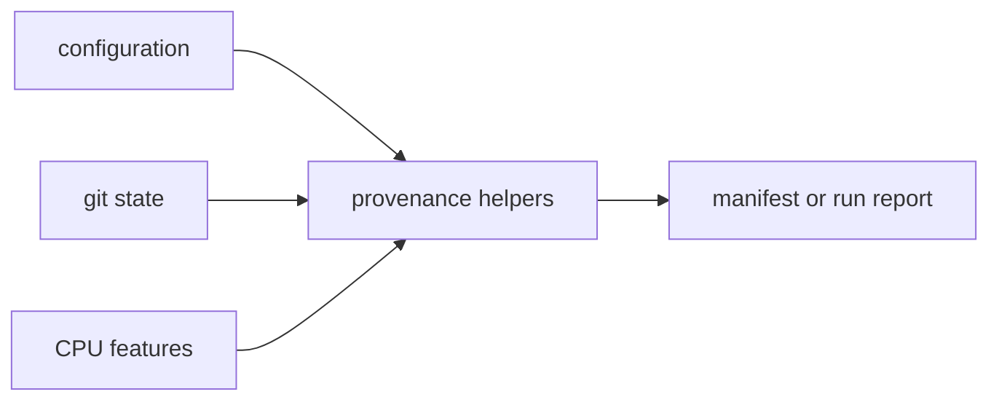

# Hashing

`bijux-gnss-infra` owns repository-facing provenance hashing. Hashes here
describe how a run was prepared and which repository inputs surrounded it. They
are reproducibility evidence, not scientific identity and not a general
cryptographic utility layer.

## Provenance Flow

## Owned Helpers

| helper | responsibility |
| --- | --- |
| `hash_config` | Hashes configuration content so a run can name the exact input shape it used. |
| `git_hash` | Captures the repository commit identity when available. |
| `git_dirty` | Records whether local source changes were present during evidence capture. |
| `cpu_features` | Captures relevant execution-environment details that can affect reproducibility. |

## Contract Rules

- Hashing must be deterministic for the same normalized input.
- Dirty or missing repository provenance must stay visible; it must not be
  collapsed into a clean-looking value.
- Hashes identify repository evidence, not GNSS truth. A matching hash does not
  prove a scientific result is valid.
- This crate should not grow unrelated cryptographic helpers unless they are
  needed for artifact or run provenance.

## Reader Guidance

Use hashing outputs to compare run inputs, explain evidence, and diagnose
reproducibility differences. Use artifact validation docs when the question is
whether an artifact payload satisfies its schema. Use receiver or navigation
docs when the question is whether the run result is scientifically acceptable.

## Review Checks

- New provenance fields need a consumer in manifests, reports, or validation
  evidence.
- Changes to normalization need before/after fixture coverage.
- Do not remove dirty-state reporting to make local runs look cleaner.
