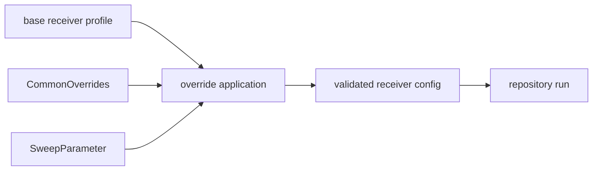

# Overrides

`bijux-gnss-infra` owns typed repository-side receiver-profile override
application. Overrides let experiments and validation commands vary controlled
configuration fields without cloning full profile files or passing untyped
string maps through the receiver.

## Override Flow

## Owned Surface

| item | role |
| --- | --- |
| `CommonOverrides` | Carries shared fields that repository workflows may override safely. |
| `apply_common_overrides` | Applies shared overrides to a receiver profile or config target. |
| `apply_overrides` | Applies the structured override set used by CLI and experiment workflows. |
| `apply_sweep_value` | Applies one sweep-expanded value through the same typed path as direct overrides. |

## Contract Rules

- Overrides must be typed at the infrastructure boundary. A free-form key/value
  map can be parsed before this layer, but the public application contract must
  be explicit.
- Overrides must not bypass receiver validation. The output still needs to pass
  the receiver-owned configuration contract.
- Sweep application and direct override application must agree on field meaning,
  units, and invalid-value behavior.
- Infra may change repository experiment inputs; it must not redefine receiver
  defaults or navigation science.

## Review Checks

- New override fields need a documented unit, valid range, and owning receiver
  or navigation field.
- Any new sweep key must use the same validation path as the corresponding
  direct override.
- Tests need to cover invalid values, not only successful mutation.
