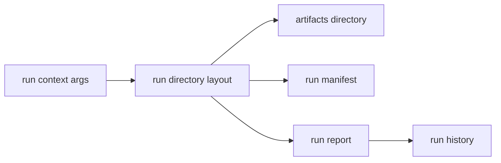

# Run Layout

`bijux-gnss-infra` owns the repository contract for persisted GNSS execution
state. Run layout is the durable footprint a reader inspects after a command
finishes: directories, manifests, reports, histories, and artifact locations.

## Run Layout Flow

## Owned Responsibilities

- `RunContextArgs` and `RunDirectoryLayout`
- `run_dir` and `artifacts_dir` path resolution
- `RunManifest`, `RunReport`, and `RunHistoryEntry`
- manifest and report persistence through `write_manifest` and `write_run_report`
- history append semantics through `append_run_history_entry`
- infrastructure-side artifact header construction

## Reader Contract

Run naming, directory shape, manifest persistence, and history append behavior
are repository concerns. A caller should not build paths by hand or invent
manifest fields outside this layer. The same logical run context should always
resolve to the same repository footprint unless the caller changes a declared
run identity input.

## Boundary Rules

- CLI commands may choose a run context, but they do not own the layout shape.
- Receiver code may emit artifacts, but it does not own manifest persistence.
- Navigation and signal crates should treat persisted paths as infrastructure
  state, not scientific input.

## Change Discipline

Changes here affect durability:

- manifests and reports must remain understandable after the command that produced them is gone
- path resolution must stay deterministic for the same run context
- history appends must remain stable enough for downstream indexing and audit workflows

## Review Checks

- Does a new field belong in a durable manifest/report, or is it transient
  command output?
- Is the run identity deterministic and explainable from typed inputs?
- Does the change keep generated output under governed repository output
  locations?
