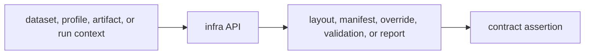

# Tests

`bijux-gnss-infra` tests protect repository infrastructure contracts:
overrides, datasets, run layout, artifact validation, provenance, and guardrail
alignment. They are not substitutes for receiver, signal, or navigation science
tests; they prove that repository-owned evidence is routed and described
correctly.

## Test Flow

## Test Families

| family | protects | useful entrypoint |
| --- | --- | --- |
| overrides | Typed profile mutation, sweep-key behavior, invalid override refusal. | `cargo test -p bijux-gnss-infra --test integration_overrides` |
| guardrails | Package boundary and policy alignment for infra itself. | `cargo test -p bijux-gnss-infra --test integration_guardrails` |
| datasets and run layout | Dataset resolution, metadata interpretation, and deterministic output paths. | Add targeted integration coverage when those surfaces change. |
| artifacts and validation | Artifact explanation, validation adapters, and reference comparison bridges. | Add targeted integration coverage beside the changed adapter. |
| provenance | Git, config, CPU, and hash evidence used by run reports. | Add deterministic assertions when provenance fields change. |

## Contract Rules

- Infrastructure tests should assert durable repository behavior, not incidental
  string formatting.
- Tests that write run evidence must use repository-owned artifact locations or
  isolated test directories.
- A new public infra API needs a narrow test that proves its boundary behavior.
- Re-export behavior should be tested only when the re-export is part of a
  supported workflow; scientific behavior remains tested in the owning crate.

## Review Checks

- If a test adds a new output path, update run-layout or artifact docs in the
  same change.
- If a test asserts a profile override, include invalid or unsupported values.
- If an infra test starts constructing receiver internals directly, move that
  proof to the receiver crate and keep infra focused on repository contracts.
