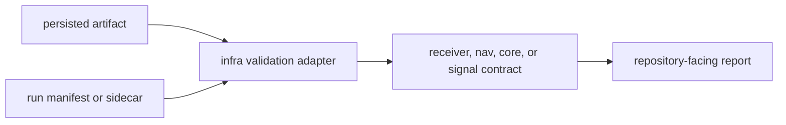

# Validation

`bijux-gnss-infra` owns infrastructure-side validation over persisted artifacts
and reference comparison entrypoints. It validates evidence after it exists in a
repository context; it does not decide receiver runtime behavior while a run is
executing.

## Validation Flow

## Validation Families

| family | responsibility |
| --- | --- |
| artifact inspection | Explain and validate persisted artifact payloads in `src/artifact_inspection/`. |
| reference comparison | Route repository-facing comparison through `src/validate_reference.rs`. |
| receiver validation bridge | Re-export receiver validation helpers for infrastructure workflows. |
| feature-gated nav validation | Re-export navigation validation helpers only when `nav` is enabled. |

## Boundary Rules

- Persisted artifacts, manifests, sidecars, and repository-facing interpretation
  belong here.
- Runtime stage behavior belongs to `bijux-gnss-receiver`.
- Artifact schema meaning belongs to `bijux-gnss-core` when the payload is a
  shared contract.
- Validation reports must preserve the owning crate's refusal or degraded status
  rather than converting it into a generic pass/fail phrase.

## Review Checks

- New validation adapters need the owning contract named in docs or code.
- Feature-gated validation needs clear unavailable behavior when `nav` is off.
- Tests should cover malformed persisted inputs, not only successful artifacts.
