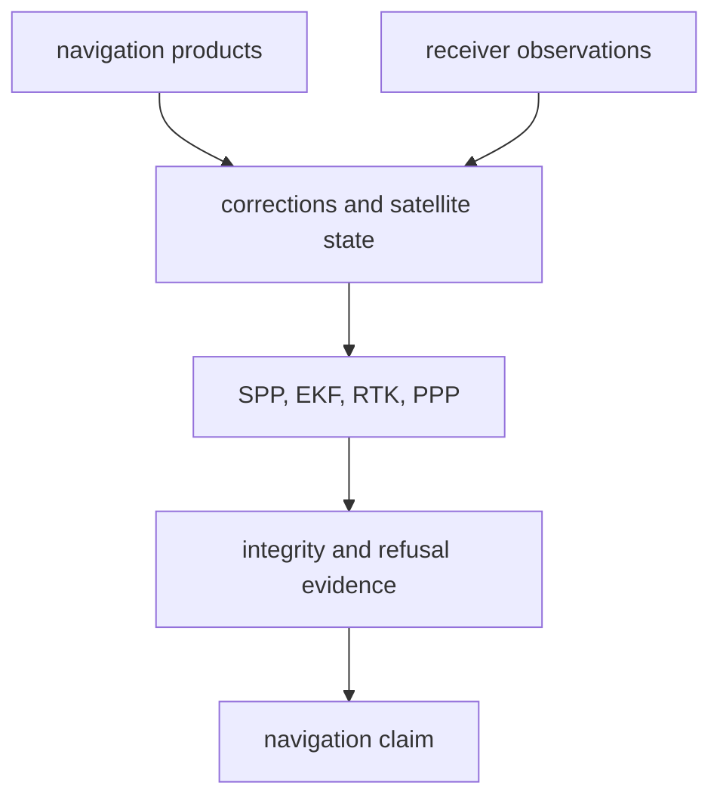

# bijux-gnss-nav API

`bijux-gnss-nav` exposes navigation-domain science. Its public API receives
observations and navigation products, applies navigation models, and returns a
solution, refusal, residual, or evidence artifact. It is not a receiver runtime
or repository persistence crate.

## API Map

| family | representative items | contract owned here |
| --- | --- | --- |
| product formats | RINEX, SP3, CLK, ANTEX, broadcast navigation decoders | Parse external navigation products into typed records with explicit time context. |
| orbit and clock state | `GpsEphemeris`, `PositionSatelliteState`, satellite-state builders | Turn broadcast or precise products into satellite state consumed by estimators. |
| corrections | atmosphere, ionosphere, group delay, bias, phase windup, combinations | Apply navigation-domain physical corrections to observations. |
| position runtime | `PositionRuntime`, `PositionRuntimeConfig`, `PositionBroadcastNavigation`, `PositionSolution`, `PositionSolveRefusal` | Execute positioning with explicit support, refusal, and evidence contracts. |
| integrity | RAIM, replay timing, constellation clock consistency, residual correlation, protection levels | Classify solution risk and refusal evidence. |
| RTK | single differences, double differences, baseline solving, ambiguity state, ratio tests, fix hold | Build and evaluate relative-positioning claims. |
| PPP | `PppConfig`, `PppFilter`, precise-product policy, stochastic evidence, ambiguity readiness | Build precise-positioning evidence and lifecycle reports. |
| time | GPS, Galileo, BeiDou, GLONASS, UTC, week rollover helpers | Interpret navigation time systems without receiver-specific sample scheduling. |

## Reader Guidance

- Start with `PositionRuntime` for ordinary positioning execution.
- Start with `formats` exports when the question is about external navigation
  product parsing.
- Start with correction exports when the question is about ionosphere,
  atmosphere, bias, windup, or observation combinations.
- Start with RTK or PPP families only when the caller has the required
  differenced observations, precise products, or ambiguity evidence.

## Boundary Rules

- Navigation APIs may consume receiver observations; they do not schedule
  receiver channels, own tracking loops, or parse raw-IQ captures.
- Solvers must return explicit refusal evidence when geometry, clocks, products,
  covariance, or integrity checks do not support a claim.
- Time-system expansion and rollover handling need explicit reference context
  where broadcast formats are ambiguous.
- Re-exported core geometry helpers are convenience imports; shared coordinate
  meaning remains owned by `bijux-gnss-core`.

## Review Checks

- New public estimators need a documented input contract, refusal path, and
  evidence surface.
- New correction exports need tests against independent references or checked-in
  truth fixtures.
- New format decoders need malformed-input tests and explicit week/time context
  behavior.
