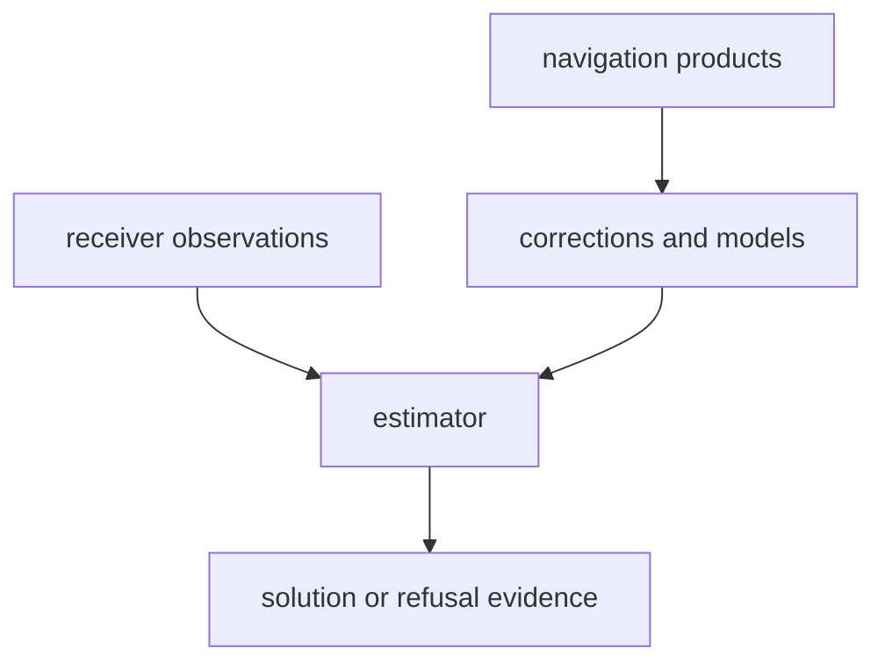

# bijux-gnss-nav

[](https://crates.io/crates/bijux-gnss-nav)
[](https://github.com/bijux/bijux-telecom/blob/main/LICENSE)
[](https://github.com/bijux/bijux-telecom)
[](https://crates.io/crates/bijux-gnss-nav)
[](https://github.com/bijux/bijux-telecom/pkgs/container/bijux-telecom%2Fbijux-gnss-nav)
[](https://docs.rs/bijux-gnss-nav/latest/bijux_gnss_nav/)
[](https://github.com/bijux/bijux-telecom/tree/main/docs/04-bijux-gnss-nav)

`bijux-gnss-nav` owns navigation-domain science: navigation-product parsing,
orbit propagation, clock products, atmospheric and antenna corrections,
position estimation, RTK, PPP, RAIM, residuals, uncertainty, and time-system
interpretation needed by navigation algorithms.

Use this crate to turn observations or external navigation products into a
typed navigation claim or a typed refusal. Raw-IQ ingest, receiver scheduling,
signal-code generation, persistence, and CLI presentation belong elsewhere.

## Availability

The first registry release has not been published. In this workspace, build or
test the package directly:

```sh
cargo test -p bijux-gnss-nav
```

After publication, add it with `cargo add bijux-gnss-nav`. The Cargo package
name is `bijux-gnss-nav`; its Rust import name is `bijux_gnss_nav`. All public
packages in this repository share one release version.

## Choose the Scientific Surface

| question | go next |
| --- | --- |
| Which external format or product is parsed? | [format guide](docs/FORMATS.md) |
| Which correction or model owns the science? | [Correction guide](docs/CORRECTIONS.md), [Model guide](docs/MODELS.md) |
| Which orbit, clock, uncertainty, or product-gap contract applies? | [orbit guide](docs/ORBITS.md) |
| How is a position, RTK, PPP, or integrity claim estimated or refused? | [estimation guide](docs/ESTIMATION.md) |
| Which time system or rollover context is required? | [time guide](docs/TIME.md) |
| What compatibility changed? | [package release history](CHANGELOG.md) |

## Owned Boundary

- navigation-product formats and parsed product records
- broadcast and precise orbit helpers
- correction models for atmosphere, bias, combinations, tides, and carrier
  effects
- position estimation, uncertainty, residual, RTK, PPP, and RAIM behavior
- navigation-specific time interpretation and rollover handling

This crate does not own raw-IQ ingest, signal-code production, receiver
tracking loops, persisted run layout, or operator command presentation.



## Scientific Result Contract

Every public result must make these concerns reviewable:

- input product or observation provenance
- constellation, signal, time system, coordinate frame, and units
- correction and model assumptions
- residual, covariance, uncertainty, or integrity evidence appropriate to the
  claim
- degraded and refused outcomes when prerequisites are missing

A successful-looking coordinate is not sufficient evidence. The
[navigation extension guide](../../docs/04-bijux-gnss-nav/operations/navigation-extension-guide.md)
defines the work required to add scientific behavior, and the
[release guide](../../docs/04-bijux-gnss-nav/operations/release-and-versioning.md)
defines compatibility evidence.

## Implementation Ownership

- The [format boundary](src/formats.rs) owns broadcast navigation, RINEX, SP3,
  CLK, ANTEX, and bias-product interpretation.
- The [orbit boundary](src/orbits/mod.rs) owns ephemeris, satellite state,
  clocks, uncertainty, and constellation-specific propagation.
- The [correction boundary](src/corrections/mod.rs) owns atmosphere, bias,
  combinations, phase windup, and observation-derived corrections.
- The [model boundary](src/models/mod.rs) owns environmental, antenna, tide,
  celestial, and NeQuick models.
- The [estimation boundary](src/estimation.rs) owns positioning, EKF, PPP, RTK,
  integrity, uncertainty, and solution claims.
- The [navigation time boundary](src/time.rs) owns week context, rollover, and
  navigation-specific time interpretation.
- The [public API](src/api.rs) owns deliberate downstream exports.

For package architecture and contracts, continue with the
[architecture guide](docs/ARCHITECTURE.md), [boundary guide](docs/BOUNDARY.md),
[contract guide](docs/CONTRACTS.md), and [public API guide](docs/PUBLIC_API.md).
The [test guide](docs/TESTS.md) maps scientific claims to proof families.

## Verification Focus

Use navigation tests that match the scientific surface changed:

```sh
cargo test -p bijux-gnss-nav --test integration_sp3
cargo test -p bijux-gnss-nav --test integration_position
cargo test -p bijux-gnss-nav --test integration_rtk_double_difference
```

Repository-wide lanes and package routing are documented in the
[workspace README](../../README.md).
