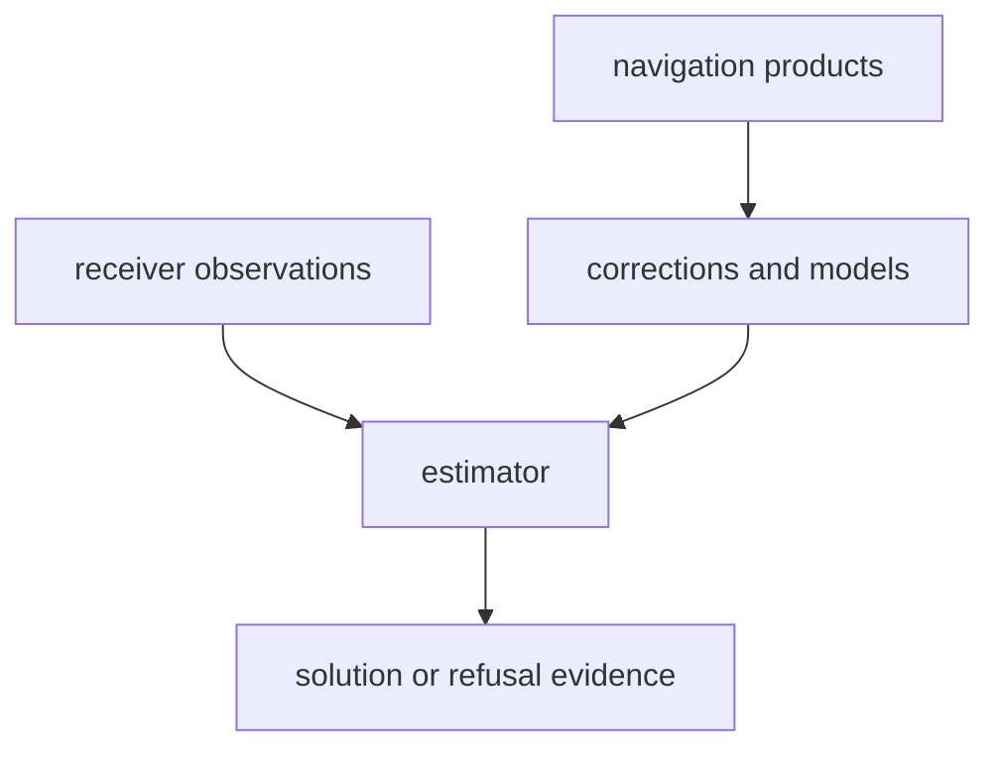

# bijux-gnss-nav

`bijux-gnss-nav` owns navigation-domain science: navigation-product parsing,
orbit propagation, clock products, atmospheric and antenna corrections,
position estimation, RTK, PPP, RAIM, residuals, uncertainty, and time-system
interpretation needed by navigation algorithms.

Start here when the question is about turning observations or external
navigation products into a navigation claim. Do not start here for raw-IQ
ingest, receiver scheduling, signal-code generation, or CLI presentation.

## Reader Route

| question | go next |
| --- | --- |
| Which external format or product is parsed? | [Format guide](docs/FORMATS.md), `src/formats.rs` |
| Which correction or model owns the science? | [Correction guide](docs/CORRECTIONS.md), [Model guide](docs/MODELS.md) |
| Which orbit or clock contract applies? | [Orbit guide](docs/ORBITS.md), `src/orbits/` |
| How is a solution estimated or refused? | [Estimation guide](docs/ESTIMATION.md), `src/estimation/` |
| What changed in this package? | [Package changelog](CHANGELOG.md) |

## Owned Boundary

- navigation-product formats and parsed product records
- broadcast and precise orbit helpers
- correction models for atmosphere, bias, combinations, tides, and carrier
  effects
- position estimation, uncertainty, residual, RTK, PPP, and RAIM behavior
- navigation-specific time interpretation and rollover handling

This crate does not own raw-IQ ingest, signal-code production, receiver
tracking loops, persisted run layout, or operator command presentation.



## Source Map

- `src/orbits/` owns satellite-state and ephemeris logic.
- `src/formats.rs` owns navigation and precise-product parsing families.
- `src/corrections/` owns atmosphere, bias, combinations, tides, and
  carrier-aware computations.
- `src/estimation/` owns SPP, PPP, RAIM, EKF, and RTK surfaces.
- `src/models/` owns environmental and antenna models.
- `src/time.rs` and `src/time/` own navigation-specific time behavior.

## Documentation Map

- [Architecture guide](docs/ARCHITECTURE.md)
- [Boundary guide](docs/BOUNDARY.md)
- [Correction guide](docs/CORRECTIONS.md)
- [Contract guide](docs/CONTRACTS.md)
- [Estimation guide](docs/ESTIMATION.md)
- [Format guide](docs/FORMATS.md)
- [Model guide](docs/MODELS.md)
- [Orbit guide](docs/ORBITS.md)
- [Public API](docs/PUBLIC_API.md)
- [Test guide](docs/TESTS.md)
- [Time guide](docs/TIME.md)

## Verification Focus

Use navigation tests that match the scientific surface changed:

```sh
cargo test -p bijux-gnss-nav --test integration_sp3
cargo test -p bijux-gnss-nav --test integration_position
cargo test -p bijux-gnss-nav --test integration_rtk_double_difference
```

Repository-wide lanes and package routing are documented in the
[workspace README](../../README.md).
