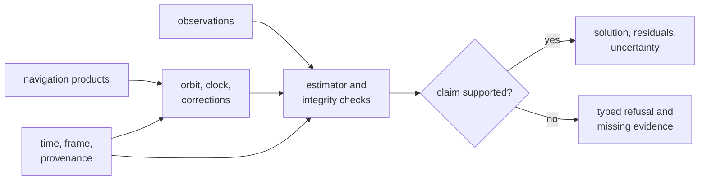

# bijux-gnss-nav

`bijux-gnss-nav` interprets navigation products and observations to produce a
positioning result, integrity evidence, or an explicit refusal. Its scope spans
broadcast and precise products, orbit and clock propagation, correction
models, SPP, filtering, RTK, PPP, RAIM, uncertainty, and navigation-specific
time handling.

The crate begins after samples have become observations or navigation-product
bytes. It does not acquire signals, schedule receiver channels, discover files,
persist runs, or choose operator-facing wording.

## A Coordinate Is Not The Whole Result

A scientifically useful result preserves the input identity, time system,
coordinate frame, correction assumptions, residuals, covariance or protection
levels, and validity state needed to judge the claim. Returning coordinates
without that context is not a successful navigation contract.

## Enter Through The Scientific Question

| Question | Guide |
| --- | --- |
| Which broadcast or precise format can be parsed? | [Navigation product formats](docs/FORMATS.md) |
| How is satellite position, velocity, clock, or product uncertainty obtained? | [Orbit and clock behavior](docs/ORBITS.md) |
| Which atmospheric, bias, antenna, tide, or combination correction applies? | [Correction models](docs/CORRECTIONS.md) and [environmental models](docs/MODELS.md) |
| How are SPP, filters, RTK, PPP, RAIM, and refusals represented? | [Estimation and integrity](docs/ESTIMATION.md) |
| Which week context, rollover, or time conversion is required? | [Navigation time](docs/TIME.md) |
| Which exports are supported for downstream users? | [Public API](docs/PUBLIC_API.md) |

The public `api` module is broad because it serves parsers, model users, and
estimators. Prefer the smallest family that matches the application instead of
building against unrelated exports. Shared identities, observations, units,
and result records come from the
[core package](../bijux-gnss-core/README.md).

## Refuse Missing Scientific Context

Navigation inputs are often structurally parseable but scientifically
insufficient. Callers and new APIs should preserve refusal evidence when:

- broadcast time lacks the reference context needed to resolve a week;
- ephemeris, clock, antenna, bias, or correction products are absent or stale;
- the observation geometry cannot support the requested state;
- residual, covariance, integrity, or convergence criteria fail;
- a requested advanced mode lacks its declared prerequisites;
- units, signal identity, time scale, or coordinate frame are ambiguous.

Do not replace these cases with zero values, guessed epochs, or
successful-looking coordinates. The [contract guide](docs/CONTRACTS.md)
identifies the typed outcomes that cross the package boundary.

## Feature Status

The package declares one feature, `precise-products`, and enables it by
default. At present, no navigation source is conditionally compiled by this
feature; it acts as a compatibility and dependency-forwarding marker for
higher-level packages. Disabling it does not currently remove parsers or model
code from `bijux-gnss-nav`.

That distinction matters for consumers evaluating binary size or capability
isolation: rely on actual compiled behavior, not the feature name alone. If
source gating is introduced later, it is a compatibility change and needs
explicit tests and release notes.

The first registry release has not been published. The prepared Cargo package
name is `bijux-gnss-nav`, and its Rust import name is `bijux_gnss_nav`.

## Match Evidence To The Claim

Parser tests prove format interpretation, not orbit accuracy. Model
reference vectors prove selected formulas, not complete positioning.
Synthetic positioning tests prove controlled scenarios, not field performance.
RTK, PPP, and integrity claims need their own prerequisite, convergence,
residual, uncertainty, and refusal evidence.

Use the [test evidence guide](docs/TESTS.md) to select the relevant proof and
the [architecture guide](docs/ARCHITECTURE.md) to preserve dependency
direction. Scientific and compatibility changes belong in the
[package release history](CHANGELOG.md) and follow the
[navigation release guide](../../docs/04-bijux-gnss-nav/operations/release-and-versioning.md).
