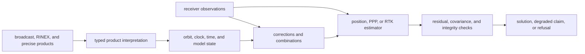
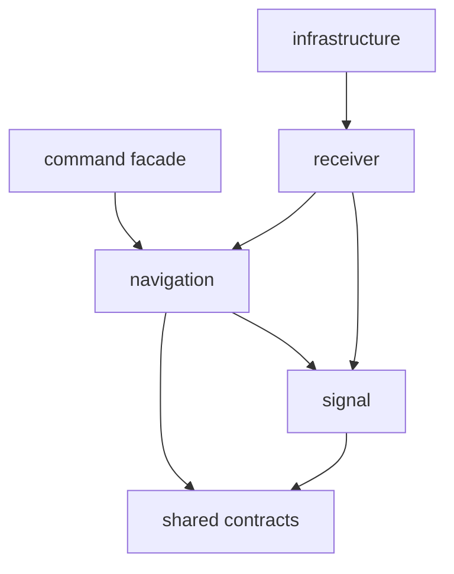

# Architecture

`bijux-gnss-nav` turns navigation products and receiver observations into
satellite state, corrections, estimates, integrity evidence, and typed
refusals. It owns scientific interpretation after observations exist; it does
not own sample processing, runtime scheduling, persistence, or command output.

## Scientific Dataflow

No stage may fabricate missing product context or turn failed prerequisites into
a plausible-looking position.

## Ownership Boundaries

| responsibility | owner |
| --- | --- |
| broadcast navigation, RINEX, SP3, CLK, ANTEX, and bias-product parsing | [format boundary](../src/formats.rs) |
| ephemeris, satellite state, clock interpretation, and uncertainty | [orbit boundary](../src/orbits/mod.rs) |
| atmosphere, bias, group delay, combinations, windup, and measured-ionosphere corrections | [correction boundary](../src/corrections/mod.rs) |
| antenna, atmosphere, celestial, tide, and NeQuick models | [model boundary](../src/models/mod.rs) |
| reusable EKF mathematics | [EKF boundary](../src/estimation/ekf/mod.rs) |
| position, residual, smoothing, RAIM, and runtime-neutral solution behavior | [position boundary](../src/estimation/position/mod.rs) |
| precise point positioning state, measurements, filters, and quality | [PPP boundary](../src/estimation/ppp/mod.rs) |
| RTK differencing, ambiguity, baseline, execution, and quality | [RTK boundary](../src/estimation/rtk/mod.rs) |
| advanced claim prerequisites, downgrade, and support evidence | [solution claims](../src/estimation/solution_claims.rs) |
| navigation time and rollover context | [time boundary](../src/time.rs) |
| small estimator matrix support | [linear algebra support](../src/linalg.rs) |
| deliberate downstream exports | [curated navigation API](../src/api.rs) |

## Dependency Direction

Navigation depends on shared core and signal contracts. Receiver may invoke
navigation, while infrastructure and the facade consume its outcomes through
receiver or public navigation APIs.

## Scientific Invariants

- Product parsing preserves provenance, time context, frame, units, and missing
  fields.
- Orbit and clock state expose uncertainty and product gaps.
- Corrections state required context and refuse incompatible observations or
  absent products.
- Estimators report residual, covariance, convergence, quality, and integrity
  evidence appropriate to the claim.
- PPP and RTK expose lifecycle and prerequisite state instead of reporting only
  successful endpoints.
- Time conversion never resolves ambiguous week or rollover context silently.

The [format guide](FORMATS.md), [correction guide](CORRECTIONS.md),
[orbit guide](ORBITS.md), and [estimation guide](ESTIMATION.md) define these
contracts in detail.

## Architectural Evidence

- [Format and decoder tests](TESTS.md) cover realistic inputs and malformed
  cases.
- [Broadcast orbit reference](../tests/integration_broadcast_orbit_reference.rs)
  protects satellite-state interpretation.
- [Position refusal coverage](../tests/integration_position_refusal.rs)
  protects unsupported solution behavior.
- [Fault injection](../tests/fault_injection.rs) and
  [long-run stability](../tests/long_run_stability.rs) protect integrity and
  numerical lifecycle behavior.
