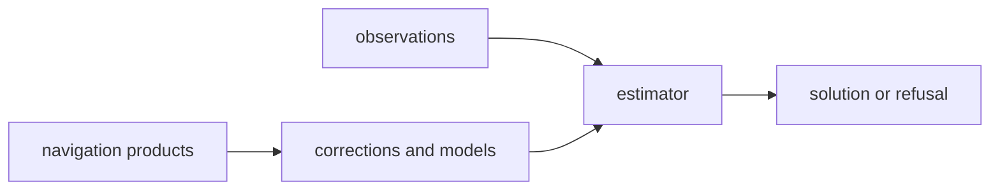

# Boundary

Owner: navigation-domain science, corrections, and estimation

`bijux-gnss-nav` owns the computations that turn navigation products and
receiver observations into a position claim, uncertainty estimate, or refusal
record. It should stay computational and explicit about product formats,
frames, timescales, and correction assumptions.

## Boundary Flow

## Owned Scope

`bijux-gnss-nav` owns:

- broadcast and precise orbit state
- navigation message and reference-product parsing
- atmospheric, bias, and signal-combination corrections
- position, integrity, PPP, and RTK estimation logic
- navigation-time and rollover utilities
- supporting physical models needed by those computations

## Out Of Scope

- receiver sample scheduling and channel orchestration
- repository run layout, manifests, and dataset registry logic
- operator CLI behavior
- generic infrastructure wrappers over persisted artifacts

## Dependency Rule

This crate stays above `core` and `signal`, but below `receiver`, `infra`, and
CLI surfaces. If a helper needs runtime orchestration or filesystem ownership,
it belongs elsewhere.

## Effect Model

This crate is primarily computational. Parsing navigation files and precise
products is allowed because those formats are part of the domain boundary, but
repository workflow policy is not.

## Review Checks

- Are frames, units, timescales, and product provenance explicit?
- Does an estimator refuse unsafe input instead of producing a misleading
  solution?
- Is the change covered by scientific validation rather than command-only
  output checks?
