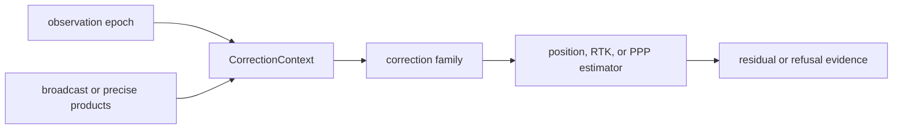

# Corrections

`bijux-gnss-nav` owns reusable navigation-domain corrections that sit between
raw receiver observations and estimation. A correction turns observation,
satellite, signal, environment, or bias context into an explicit adjustment or
diagnostic. It does not schedule receiver work or decide command output.

## Correction Flow

## Correction Families

| family | owned behavior | reader concern |
| --- | --- | --- |
| atmosphere and broadcast ionosphere | Troposphere and broadcast-ionosphere correction helpers and residual summaries. | Inputs need elevation, signal, and constellation context; outputs must preserve units. |
| group delay and biases | Code-bias, phase-bias, and broadcast group-delay conversions. | Bias provenance must stay explicit so a solution cannot silently mix incompatible sources. |
| combinations | Ionosphere-free, geometry-free, narrow-lane, and Melbourne-Wubbena diagnostics. | Combination formulas need signal-pair compatibility and wavelength clarity. |
| phase windup | Carrier phase windup correction with continuity state. | State must be carried deliberately across epochs instead of recomputed as disconnected samples. |
| measured ionosphere | Observation-derived ionosphere estimates. | Diagnostics must report when the observation set cannot support the claim. |

## Boundary Rules

- Corrections may consume receiver observations and navigation products, but they
  do not own receiver lock, acquisition, or tracking lifecycle.
- Correction outputs must use explicit units and carry enough context to explain
  why they were applied or refused.
- A correction that depends on external products must expose missing-product and
  stale-product behavior clearly.
- Shared identifiers and base coordinate meaning remain in `bijux-gnss-core`.

## Review Checks

- New correction models need independent reference tests or checked-in truth
  evidence.
- New bias providers need provenance and zero-bias behavior documented.
- New observation combinations need signal compatibility tests, unit tests, and
  invalid-pair refusal coverage.
