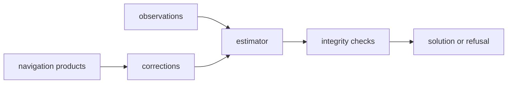

# Estimation

`bijux-gnss-nav` owns navigation estimation as a scientific boundary, not as a
receiver runtime. Estimators consume observations, satellite states,
corrections, clocks, and covariance assumptions, then return a solution,
degraded claim, or typed refusal evidence.

## Estimation Flow

## Estimation Families

| family | responsibility |
| --- | --- |
| `ekf/` | Reusable state-estimation primitives and measurement models. |
| `position/` | Positioning, integrity, smoothing, weighting, runtime-neutral solution logic, and refusal evidence. |
| `ppp/` | Precise point positioning filters, measurement models, product policy, and lifecycle evidence. |
| `rtk/` | Ambiguity, baseline, differencing, fix policy, and quality surfaces. |
| `solution_claims.rs` | Advanced claim, downgrade, prerequisite, and support-matrix reporting. |

## Boundary Rules

- Estimation may consume observations, satellite states, corrections, and
  covariance assumptions.
- Stage scheduling, sample-flow orchestration, and persisted run layout belong
  elsewhere.
- Solver outputs may be consumed by receiver, infra, and CLI crates, but the
  estimation logic itself stays owned here.
- Solvers must refuse unsupported claims explicitly rather than emitting
  clean-looking invalid solutions.

## Review Checks

- New estimator APIs need input assumptions, covariance behavior, and refusal
  paths documented.
- Solver-local helpers should stay private unless higher-level crates need a
  durable navigation contract.
- Integrity and protection-level behavior need tests for both accepted and
  rejected claims.
